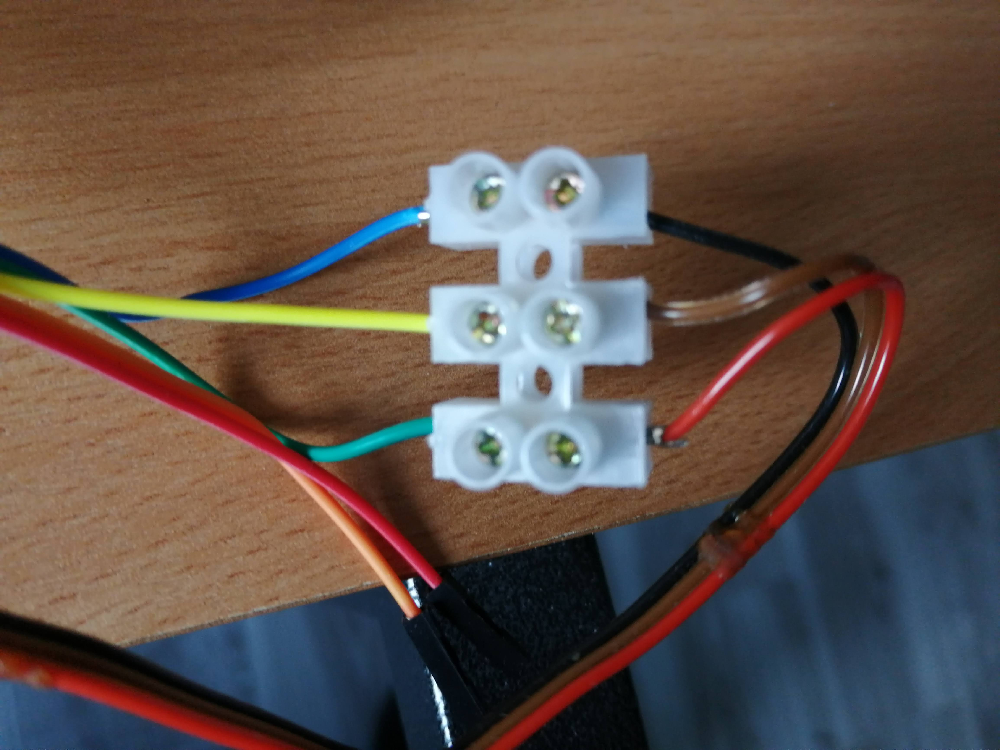

# TODO

* [ ] Partition 512/512
* [ ] Revoir la machine d'état boot, connexion WiFi, Basic, Connexion à un site
  distant. Tout intégrer au BASIC ? Config / Autoexec
* [ ] Possibilité
* [ ] Manuel utilisateur BASTOS (à commencer, à l'ancienne)

## Code commun

* [x] Remettre en 1200-7E1 pas 115200
* [x] Après un reset sur l'ESP : Bannière BASTOS
* [ ] repasser en SPIFS
* [ ] Commandes FS : <https://www.overtakenbyevents.com/amstrad-cpc-amsdos-commands/>
* [ ] Connexion WiFi, affichage IP
* [ ] Connexion à un site par défaut ? (3615)
* [ ] AUTOEXEC ?

## Intégration SONOFF

* [ ] Gérer le bouton du Sonoff : ON / OFF Minitel + RESET
* [ ] Gestion télérupteur
* [ ] Gestion Led
* [x] À priori, retirer OTA
* [ ] Voir si on peut récupérer de la place pour le disque et gérer les
  répertoires (genre 512Ko prog / 512Ko LittleFS (128 fichiers))

## Interface PC / Émulateur

* [x] Doit être intégré dans l'émulateur (ouvrir port série au lieu de network)
* [x] Plus de différence VT100 => on utilise l'émulateur pour se connecter au
  SONOFF ou à la carte de dev ESP01-S

## Serveurs

### Serveurs sur IP

* [x] Porter Zboub (TCP / IP, dployé sur IONOS)
* [ ] Essayer d'autres prog stdin/stdout avec `ncat` (voir BASTOS server script)
  * [ ] Si le programme n'est pas écrit pour Minitel : voir ce qu'on peut faire
    avec le clavier, voir le mode mixte et téléinformatique du minitel 1B
  * [ ] Penser à l'option CR/LF de ncat
  * [ ] Exemple Lua : `ncat -lk -vvv -C -c "lua -i 2>&1" 127.0.0.1 1967`
  * [ ] Ne marche pas : `ncat -lk -vvv -C -c "python3 -i 2>&1" 127.0.0.1 1967`
* [ ] API minitel sur stdin / stdout en C / Dart ?

### Serveur local

Doivent être en C pour être intégrés à minwifi.

* [ ] Interface à la BASTOS : send_keys, loop, callbacks IO
* [ ] Connexion manager
* [ ] API minitel intégré ?

## Basic

* [ ] Variables WiFi dans fichier invisible par CAT, let, load vars, save vars
  et init Wifi
* [ ] MODE, MINITEL, TELNET, CONNECT <url>
* [ ] SAVEVARS
* [ ] SAVE, LOAD : pouvoir faire du .BAS et du BST. Majuscules / Minucules :
  toujours en majuscules sur disque, pour faire plus rétro.
* [ ] PAUSE
* [ ] TAB
* [ ] Autres commandes Minitel (AI, AN, REP, etc, voir MIN)
* [ ] PLOT / UNPLOT / TEST ?
  * [ ] VT100 : https://www.w3schools.com/charsets/ref_utf_block.asp
  * [ ] Minitel, semi graphique
* SCREEN : Il faudrait conserver un état et gérer les déplacements curseurs
* [ ] RAND
* [ ] SCROLL
* [ ] MODE (mode écran)
* [ ] RUN line, RUN "autorun.bst", RUN "program.bst", line
* [ ] EVAL / EVAL$
* [ ] DOWNLOAD / UPLOAD
* [ ] TELNET / TELNET WS
* [ ] Ajouter mode rouleau, mode 40/80, co, coff, echo
* [ ] EDIT line ?
* [ ] Support Suite / Retour / Sommaire (TAB ou PGDN / SHIFT TAB ou PGDUP/ HOME)
* [ ] Régler le pb du nom mDNS de l'ESP quand il vient d'être flashé par USB
  serial
* [ ] tty : init string, fast, autoexec => config$$$
* [ ] Print integer et print float => internes à bastos (voir str$), plus qu'une
  seule commande print.
* [ ] Optimisation BIO (une seule structure), 1 fonction number (int), 2/3
  params (union as_void_ptr, as_char_ptr, as_int, as_float), 1 result (union
  like param) => static / extern
* [ ] Dans `test` : pouvoir lire un fichier `.bas` sur la ligne d'entrée et
  l'envoyer à `bastos_send_keys`. Ce serait bien aussi de pouvoir construire un
  disque à distance
* [ ] Limiter noms de fichier à 15 caractères, ajouter ".bst" ?
  * [ ] CAT ne doit pas afficher les fichiers finissant par "$$$", sauf avec cat
    hidden (ou cath)
* [ ] Ajouter edit, integration "edit_min" ?
* [ ] vitesse serial ()
* [ ] **BUGS UI / AMELIORATIONS**
  * [ ] `Error 1` quand on se logue : utiliser `nc` pas telnet
  * [ ] Pouvoir sauvegarder uniquement les variables (config manager, "SAVE VARS")
  * [ ] Faire un config manager plus complet (vitesse port Minitel par exemple) ?
* [ ] **OPTIMISATIONS**
  * [ ] Optimisation accès tableau / variable (factorisation number / string, name)

# Done

* [x] Passer tout en float
* [x] Coder `eval_factor`
* [x] Code `( expr )` dans factor ?
* [x] Gérer la virgule et l'exposant
* [x] Ajouter les fonctions numériques sur float SIN, COS, etc et PI, RND, CODE
* [x] Ajouter les variables
* [x] Ajouter RUN / CLEAR / NEW
* [x] Ajouter io (interface avec materiel)
* [x] printf: ansi / minitel
* [x] INPUT (envoie de caractères depuis le main vers le basic)
* [x] print sur network (client wifi)
* [x] Variables strings
* [x] Expressions strings
* [x] SAVE / LOAD prog
* [x] SAVE / LOAD vars
* [x] Ajouter FS sur target ESP-01
* [x] Ajouter CAT, ERASE
* [x] Minimal embedded config manager
* [x] Config manager minimal dans le codeOTA
* [x] Ajouter "RESET"
* [x] AT, INK, PAPER, CLS
* [x] Toutes les fonctions qui produisent des codes de commandes => fonctions
  qui renvoient des chaines de caractères (au début .h minitel). On doit pouvoir
  faire : let a$=cls + at 10,10 + ink 4 + paper 3 + " *DEMO* ".
* [x] Mettre en "echo" distant (pas d'echo local)
* [x] Faire que les keywords aient le même ID (possible sans sort ?) afin
  d'assurer la compatibilité "binaire" des `*.bst`
* [x] comparaison, condition sur number et string
* [x] IF, THEN, GOTO
* [x] FOR, NEXT
* [x] GOSUB, RETURN
* [x] REM, LEN
* [x] CR/LF , DEL, sur ESP01-1M
* [x] TO en opérande gauche LET A$(1 TO 2) = "AB"
* [x] DIM
* [x] Tableaux (DIM)
* [x] Slice on left value
* [x] INKEY$
* [ ] **OPTIMISATIONS**
  * [x] Optim tout dans le même .c pour les static
  * [x] Mem : bloc pour prog, bloc pour vars, que des listes (avec ptr/index sur
        16 bits),
  * [x] Rapporter tout le basic sauf l'API bastos dans un seul fichier et static
    functions (notamment memory)
  * [x] Global Memory Management
    * [x] Sous allocateur vars
    * [x] Sous allocateur prog
    * [x] Sous allocateur strings (calculs)
    * [x] var systèmes + bstate dans global memory
    * [x] buffer IO
    * [x] buffer tokens : dans bstate, c'est un prog_t
  * [ ] Optimisation parser (règles et code générique)
  * [x] New memory model : ~~Transformation tree -> list (parcours GRD, etc) à mettre dans ds~~
  * [x] Removed Wifi client and server from MINITEL build
  * [x] N'optimise pas : Unifier load / save methods (read_uint16, read_len_mem0)
  * [x] Unifier FFI (bio.*) : un genre de callback fourre tout à la `ioctl` ?
  * [x] Versions de platform @ 3.2.0 et xtens8266 au 220621

# Procédures

## Prise péri informatique

```
TX -     - RX
    / | \
 9v   0v  PT
```

Sur le fil DIN noir :

* TX : Bleu
* RX : Rouge
* Tresse : 0v

* 9v : Vert
* OT : Blanc

Sur la DIN, 3 fils souples papa :

* TX : Marron
* RX : Rouge
* 0v : Noir

## Connexion PC avec FTDI

```
$ ls /dev/ttyUSB*
/dev/ttyUSB0
$ /home/alain/.platformio/packages/tool-esptoolpy/esptool.py --chip esp8266 --port /dev/ttyUSB0 write_flash --flash_size detect 0x0 0x00000_blank1m.bin
```

*** ATTENTION AU 3.3v DU FTDI ***

*** LA PROGRAMMATION DOIT SE FAIRE AVEC `board_build.flash_mode = dout` ***

```
[env:esp01_1m]
platform = espressif8266
board = esp01_1m
framework = arduino
upload_speed = 230400
monitor_speed = 115200
monitor_echo = no
monitor_raw = yes
board_build.flash_mode = dout
board_build.ldscript = eagle.flash.1m64.ld
lib_deps = links2004/WebSockets@^2.3.7
board_build.filesystem = littlefs
```


> Programming the ESP01s (Sonoff)
>
> With the Sonoff circuit completed and IoT Cloud configurations done, let's try
> to upload the sketch to the device.To upload the Arduino sketch to this
> device, follow the steps below:
>
> 1. Open the sketch tab in the IoT Cloud
> 2. Make sure that your USB to Serial converter is connected properly
>    (otherwise go back to the start of this tutorial).
> 3. Press and hold the reset button onboard the PCB (see image below), and
>    connect the USB >Serial converter to your computer.
> 4. The LED on the Sonoff Basic should now be OFF . If it is red or blinking
>    blue, try to disconnect and connect again (while holding the reset button).
> 5. The ESP01s should now be in bootloader mode, and the port should be
>    detected in the dropdown of available boards in the SKETCH tab in the IoT
>    Cloud.
> 6. Click on the upload button. The uploading process will take a while, DO NOT
>    DISCONNECT until it is finished.When it has finished uploading, it will
>    take some time for the ESP device to connect to the WiFi network, and to
>    the IoT cloud.
>
> You can open the Serial Monitor for information regarding your connection.

## Connexion Minitel



## Mise à jour framework

* Erase flash
* Full Clean
* Dependencies / Update
* Build

## Travail avec Minterm

TODO: Serveur BASTOS (`bastos-server.sh`)

## Travail avec la carte de dev

`[env:esp01_1m_nodecmu]` : Un firmware complet pour un ESP01s branché
directement sur un FTDI / programmateur. Identique au firmware sonoff, tout est
transmis par USB Serial. Il doit être utilisé avec `minterm`. Lorsqu'on _upload_
en local, que ce soit le _firmware_ ou le _file system_, il faut penser à
arrêter le _monitor_ et l'émulateur s'ils sont connectés par _serial_. Pour le
_file system_, les fichiers doivent être dans le répertoire `data`. Le
téléchargement s'effectue correctement même s'il se termine en erreur.

## Travail avec le Sonoff

`[env:sonoff]` : Un firmware complet pour un sonoff. Pour la programmation,
l'interface série TTL du Sonoff doit être reliée par un FTDI / USB Serial au PC.
Pour le test, on peut utiliser `minterm`. En exploitation il est relié à la
prise péri-informatique d'un Minitel.

## Style C

```
$ astyle --style=1tbs -s4 src/*
```

## Versions pour optim

```
Resolving minwifi_ota dependencies...
Platform espressif8266 @ 3.2.0 (required: espressif8266 @ 3.2.0)
├── framework-arduinoespressif8266 @ 3.30002.0 (required: platformio/framework-arduinoespressif8266 @ ~3.30002.0)
├── tool-esptool @ 1.413.0 (required: platformio/tool-esptool @ <2)
├── tool-esptoolpy @ 1.30000.201119 (required: platformio/tool-esptoolpy @ ~1.30000.0)
├── tool-mklittlefs @ 1.203.210628 (required: platformio/tool-mklittlefs @ ~1.203.0)
├── tool-mkspiffs @ 1.200.0 (required: platformio/tool-mkspiffs @ ~1.200.0)
└── toolchain-xtensa @ 2.100300.220621 (required: platformio/toolchain-xtensa @ ~2.100300.0)

Libraries
└── WebSockets @ 2.4.1 (required: links2004/WebSockets @ ^2.3.7)
```

## Pour l'article

* pio dans vscode (menus)
* sinon il faut avoir pio en ligne de commande : `source
  ~/.platformio/penv/bin/activate`

```
$ pio run --list-targets
$ pio device monitor
$ pio run -e minwifi
$ pio run -e minwifi -t clean
```

# Liens

## 8266 / 8285

* Flash : <https://nodemcu.readthedocs.io/en/latest/flash/>
* 8266 / 8285 diff + flash + example : <https://itead.cc/diy-kits-guides/using-esp8266-esp8285-to-blink-an-led/#:~:text=Differences%20between%20ESP8285%20and%20ESP8266&text=ESP8285%20integrates%201MB%20Flash%20in,work%20even%20after%20successfully%20download.>

## ZX

* <http://problemkaputt.de/zx.htm>
* ZX81 memory map : <https://problemkaputt.de/zxdocs.htm#zx80zx81>
* ZX81 memory map : <http://otremolet.free.fr/otnet/otzx/zx81/basic-progr/chap27.html>
* ZX emulator : <https://fuse-emulator.sourceforge.net/>
* Basic ZX81 : <http://otremolet.free.fr/otnet/otzx/zx81/basic-progr/appxc.html>
* Sinclair Basic : <https://en.wikipedia.org/wiki/Sinclair_BASIC>
* Prog spectrum à porter sur zx81 : https://zxbasic.readthedocs.io/en/docs/examples/snake.bas/

## VT100

* Codes VT100 : <https://espterm.github.io/docs/VT100%20escape%20codes.html>

## Minitel

* <https://minitel.cquest.org/miedit-page.html>, <https://medium.com/@cq94/computel-de-retour-1340d00ea79e>
* <https://www.museeminitel.fr/>
* <https://www.minitel.org/>
* <http://pficheux.free.fr/xtel/>
* <https://forum.museeminitel.fr/t/minitel-esp32-carte-peri-informatique-wifi-ble/711/42>
* <https://www.tindie.com/products/iodeo/minitel-esp32-dev-board/>
* Code minitel : <http://millevaches.hydraule.org/info/minitel/specs/codes.htm>
* Python minitel avec fonctions et code :
  <https://github.com/Zigazou/PyMinitel/blob/master/minitel/Minitel.py>

## WebSocket Minitel

* Web sockets et liens vers services sur IP :
<https://cq94.medium.com/retour-du-minitel-sur-le-web-8b8693ae8c6a>
* <http://3611.re/> : Dans `minitel-3611.js` on a l'URI de la WebSocket :
  `"ws://3611.re/ws"`

Test avec Python, on installe `sudo apt install python3-websockets`.

Service de test "echo" :

```sh
$ python3 -m websockets ws://echo.websocket.events
```

Sur un WebSocket Minitel on reçoit directement du videotex :

```
$ python3 -m websockets "ws://3611.re/ws"
```

Donc il suffit d'utiliser la lib WebSocket pour ESP8266 et le tour est joué.

## Database de service minitel

* À voir avec minitel.org ou cq94.

# Deprecated

## OTA

### Mise à jour du firmware

Procédure qui ne marche pas :

* Flash par USB serial => SW reboot de l'ESP
* Après le reboot => FOTA

Il faut **absolument** faire un HW reset de l'ESP :

* Flash par USB serial => SW reboot de l'ESP
* Débrancher / Rebrancher l'ESP => HW reboot
* FOTA fonctionne

### Mise à jour du filesystem

Il faut fixer "Upload Filesystem Image OTA" :
<https://github.com/platformio/platform-espressif8266/issues/263>

Appliquer le patch sur :
`/home/alain/.platformio/platforms/espressif8266/builder/main.py`

```python
 311  if "uploadfsota" in COMMAND_LINE_TARGETS:
```
