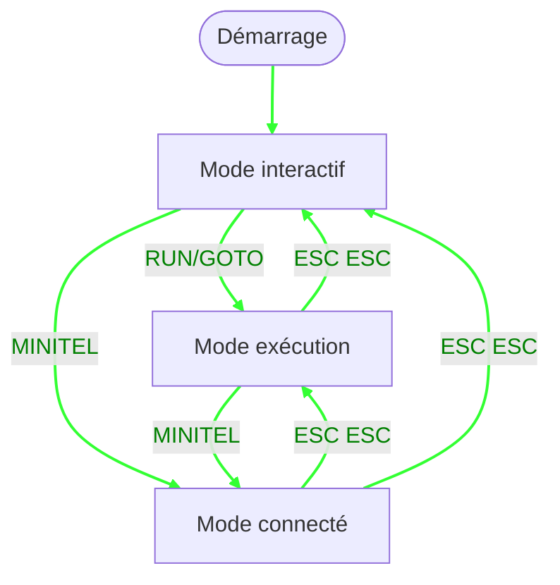

# 1. Aperçu

BASTOS est un dialecte BASIC conçu spécifiquement pour fonctionner sur terminal
Minitel via liaison série. Les programmes sont composés de lignes numérotées
exécutées dans l'ordre.

BASTOS dispose de trois modes opérationnels :

- **Mode interactif** : Les lignes entrées sont interprétées immédiatement. Si
  une ligne possède un numéro, elle est enregistrée dans le programme. C'est le
  mode d'entrée des commandes et d'édition des lignes de programme.

- **Mode exécution** : Un programme est en train de s'exécuter (lancé avec `RUN`
  ou `GOTO`). Le clavier peut être lu avec `INPUT`, `VKEY` et `INKEY$`. L'écran
  est contrôlé par `PRINT` et les commandes TTY. Appuyer deux fois sur ESC
  permet de sortir du mode exécution et de revenir au mode interactif.

- **Mode connecté** : BASTOS est connecté à un serveur via la commande
  `MINITEL`. Les entrées clavier sont envoyées au serveur, et l'écran affiche la
  réponse du serveur. Appuyer deux fois sur ESC permet de sortir du mode
  connecté et de revenir au mode précédent (soit exécution, soit interactif).


```mermaid
flowchart TD
    start([Démarrage])
    interactif["Mode interactif"]
    execution["Mode exécution"]
    connecte["Mode connecté"]

    start --> interactif
    interactif --> |RUN/GOTO| execution
    interactif -->|MINITEL| connecte
    execution -->|ESC ESC| interactif
    execution -->|MINITEL| connecte
    connecte -->|ESC ESC| execution
    connecte -->|ESC ESC| interactif
    linkStyle default stroke:#3f3,stroke-width:2px,color:green;
```

Pour une utilisation complète du système, consultez
[BASTOS-QUICK-START-fr.md](docs/BASTOS-QUICK-START-fr.md) ou
[BASTOS-MANUAL-fr.md](docs/BASTOS-MANUAL-fr.md).

# 2. Compiler et déployer

Ce projet contient plusieurs cibles de build :

- **Firmware ESP8266** (`sonoff`) : pour Sonoff Basic R2/R3
- **Firmware ESP32-C3** (`sonoff-r4`) : pour Sonoff Basic R4
- **Binaire Linux** (`bastos`) : version Linux pour tests et développement
- **Fichiers BASTOS** (`disk/`) : programmes et données

## Prérequis

- **VSCode** avec l'extension **PlatformIO IDE**
- **make** (pour le build Linux)
- **scp** (pour le déploiement)

## Build avec VSCode + PlatformIO

### Compiler un firmware

1. Dans VSCode, ouvrir la barre latérale PlatformIO
2. Sélectionner **Project Tasks** → **Build** pour la cible actuelle
3. Ou utiliser le terminal VSCode :
   ```bash
   pio run -e sonoff          # Compiler pour Sonoff
   pio run -e sonoff-r4       # Compiler pour ESP32-C3
   ```

Le firmware compilé se trouve dans `.pio/build/<target>/firmware.bin`

### Compiler la version Linux

```bash
cd lib/basic/test
make clean && make TERM=MINITEL
```

Le binaire se trouve dans `lib/basic/test/bin/bastos`

## Déploiement automatisé

Un script `build_and_deploy.sh` automatise la compilation et le déploiement
optionnel :

```bash
# Builder seulement (sans déploiement)
./build_and_deploy.sh

# Builder et déployer sur un serveur distant via SCP
./build_and_deploy.sh user@remote:/var/ftp

# Ou modifier la variable DEPLOY_SCP_FOLDER dans le script (ligne 7)
./build_and_deploy.sh
```

**Comportement du script** :
- La **compilation se fait toujours** (firmware et version Linux)
- Le **déploiement est optionnel** — seulement si `DEPLOY_SCP_FOLDER` est fourni
  en paramètre
- Si pas de déploiement : un **WARNING** s'affiche avec les instructions de
  configuration

Le script effectue (selon la configuration) :
1. Compilation des firmware ESP8266 et ESP32-C3
2. Compilation de la version Linux
3. Copie des binaires et fichiers BASTOS via SCP (optionnel)
4. Copie de la documentation via SCP (optionnel)
