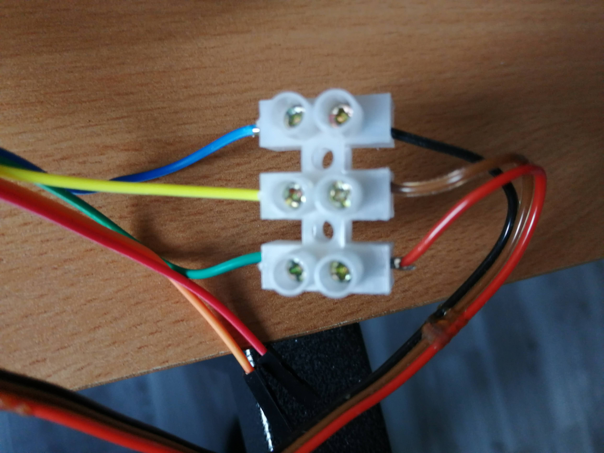

# TODO

## Version 2

* [ ] DD4012SA + SonOff Basic R4 : v1 + OTA + Commande "MINITEL WIFI" => serveur
  TCP sur BASTOS qui fait du passe plat avec la prise péri-info et téléphone ou
  PC qui se connecte aux services (telnet, tcp, ws, wss)
* [ ] `TELNET` : au départ gérer avec un front end `ncat` qui passe en mode
  téléinformatique, et effectue la connexion telnet
* [ ] Protocole FTP intégré à BASTOS (dispo dans le simu)
* [ ] Websockets (sans SSL) intégrées ?
* [ ] Penser à BASTOS-PI / BASTOS-PC puis BASTOS-P

## Idées futures

* Langage CISAB : Un Basic en post-fixé (RPN), à la HP + commande à adresse
  routine

## Bugs

* ~~[ ] Remplacer ESC-ESC par Ctrl+C~~
* [ ] Revisiter "Connexion/Fin"
* [ ] À valider : Touches Enter + Ctrl et Shift (CLS, HOME) : ne fonctionnent
  plus sur Minitel
* [ ] Attention : Apparemment E.Page sur minitel ne déplace pas le curseur
* [ ] Déconnexion provenant d'un serveur websocket : semble ne pas fonctionner
* [ ] `MINITEL` sur une URN non connectable => ns non connues peut engendrer un
  _crash_ du ESP => À tester en local
* [ ] Websocket minipavi : ne fonctionne pas en mode ESP (sans gateway) :
  déconnexion au bout d'un moment. Les touches ne partent pas, en tout cas on ne
  les a pas en echo local, il semble qu'on doit être en mode binaire => debug
  avec ludojoey (fonctionne en TCP)

## Fonctionnalités

* [ ] PLOT / UNPLOT / TEST (Voir serveur zboub et lib graphique)
  * [ ] VT100 : https://www.w3schools.com/charsets/ref_utf_block.asp
  * [ ] Minitel, semi graphique
* [ ] MODE (mode écran, 0: Videotex, 1:Mixte, 2:Téléinformatique)
* [ ] Design + Commande mode "Connexion Téléphone" (peut-on utiliser un URN TCP
  et la commande MINITEL vers un service Kiosque serveur sur le téléphone ?)
* [ ] CAT, FTP CAT : version avec filtre (expression régulière)  et options
  (plusieurs par lignes, pas d'en tête) => rajouter `DIR <PATTERN>`
* [ ] Ajouter répertoires dans système de fichiers
  (<https://randomnerdtutorials.com/esp32-write-data-littlefs-arduino/>)
* [ ] TAB
* [ ] RAND
* [ ] EDIT line, EDIT tout seul édite la dernière entrée (raccourci: fleche
  haut). définir une zone à partir de la ligne actuelle et sur 4 lignes pour
  pouvoir entrer au max 128 caractères : mode roleau, on se déplace de 3 lignes
  vers le bas, on demande la position curseur => l, c. On remonte en l-3, 1 ; on
  cleol ; on insere 4 lignes, on commence l'édition
* [ ] Ajouter `EDIT <LINE_NO>`, integration "edit_min" ?
* [ ] Gérer les codes DINSC, FINSC et définir les commandes BASTOS associées
* [ ] Ctrl+C à la place de ESC /ESC ?
* [ ] Quand on est connécté à un service, voir ce que fait ESC et CX/Fin
* [ ] À définir : support des touches de mise en pages dans les différents modes
  de BASTOS (CLI, INPUT, INKEY/PAUSE, prévoir un mode EDIT)
* [ ] Supprimer `BIN`, remplacer par `BASE$(<N>, <BASE>, <MAX>)`.
* [ ] File System :
* [ ] Gestion de la touche Cx/Fin
  * [*] voir avec une interface série PC <-> Minitel, quels codes on reçoit, en
  mode F en mode C clignotant
  * [*] Le traiter pour sortir du mode connecté BASTOS
  * [ ] A tester : réagir en conséquence (envoyer un autre Cx/Fin par la prise
    pour déconnecter le modem ou autre)
* [ ] Rajouter un `FORMAT$` ?
* [ ] Break qui arrive plus vite (d'abord sur device, flush sur serial, sur TCP
  il faudrait avoir un autre canal pour dier à l'mu de flusher ce qu'il a déjà
  reçu)
* [ ] PAUSE <N>, <LINENO> : Pendant le temps de la pause exécute le
  sous-programme <LINENO>. Quand `RETURN` est appelé, soit le temps est écoulé
  et le programme reprend après le `PAUSE`, soit on continue la pause jusqu'à
  épuisement du temps
* [ ] Faire NEXT tout seul remonte au dernier FOR
* [ ] PEEK (y compris variables OS ?) / POKE / USR : adresses converties par
  rapport au début du bloc (0 à 32K+4K). PEEK16 / POKE16. Les pointeurs
  pourraient être à l'extérieur et dans le bstate on ne mettrait que des offsets
  sur 16 bits => on pourrait modifier vars_start / vars_end. `@<VAR>`,
  `@<LINE_NO>`, `@DB <SET>,<KEY>`
* [ ] Gérer l'historique avec la DB config (une seule chaîne, séparée par des
  "\0", ou "HIST_0" à "HIST_9")
* [ ] Ramener les variables OS dans le bstate
* [ ] SCREEN : Il faudrait conserver un état et gérer les déplacements curseurs
  (voir dans `MINOLD.PAS`)
* [ ] Touches de direction : génère un ESC + 2 caractères ([Touches en mode
  clavier étendu](#touches-en-mode-clavier-%C3%A9tendu))
  * [x] Implémenter dans minterm (clavier virtuel et physique)
  * [x] Implémenter dans `os_get_key()`
  * [x] Touche flèche gauche + Ctrl (DEL)

## Optimisations

* [*] WebSockets : ça prend 110 KB. L'utilisation de l'API ArduinoHttpClient
  permet d'accéder aux WebSocket cliente avec une API synchrone mais économe (on
  retombe à 340383 octets (au lieu de 436xxx))
* Nouveau modèle mémoire
  * [ ] redéfinir la gestion mémoire : alloc, free, garbage collector. Tous les
    objets, prog_t, var_t, nommés ou non, sont stockés dans le heap.
  * [ ] Table des symboles/objets optimisée (prog_t, var_t), unicité, possibilité
    de lier des objets (previous/next) ou d'y accéder en absolu
  * [ ] Mem map : `[ system | handles | free space | heap (names / values) ]`,
    handles : `(name addr, class, value addr, )`. addr : adresse / 4 (12 bits),
    class : 8 bits => 1 handle : 32 bits
* [ ] Voir s'il est facile de passer en align2 et dimensions sur 2 octets
  (penser à arm32 / arm64)
* [ ] packed structure (mémoire)
* [ ] flags groupés en bit fields, élimination de bool (mémoire)
* [ ] repasser en static ce qu'on peut mettre en static (HAL ? / OS)
* [ ] Optimisation accès tableau / variable (factorisation number / string,
  name)
* [ ] Optimisation execution basic
* [ ] Optimisation tokenisation (règles, mini lex/yacc, automate)
* [ ] Optimisation parser (règles et code générique)

## Backend et doc

* [ ] Réseau social : Mastodon only
* [ ] [mastodon comments] (https://andreas.scherbaum.la/post/2024-05-23_client-side-comments-with-mastodon-on-a-static-hugo-website/)
* [ ] Blog / content : pages perso retro: Minitel / HP48 / ORIC 1 / PalmOS / ...
* [ ] Blog / hébergement
  * [ ] Free <http://les.pages.perso.chez.free.fr/bonnes-pratiques-et-cms-cle-en-main.io>.
  * [ ] Sur mesure fait avec Flutter (possibilité d'y inclure l'émulateur)
  * [ ] TEMU (https://bellard.org/jslinux/), à voir si on peut installer ça sur
  IONOS et y faire tourner des anciens softs
  * [ ] Github pages, wiki ?
* [ ] Github releases (download et procédure d'install)

* [ ] Home self hosting possible pour les services de bouncing (éventuellement
  via ngrock + authentication)
* [ ] Serveurs sur IONOS (faire framework en Dart, à la flutter éventuellement,
  <https://zetcode.com/dart/serversocket/>)
* [ ] Pouvoir alimenter un site FTP depuis un script local (FTP Bastos en
  lecture seule + Site web blog z4rd0z)
  * [ ] Blog sur alain.basty.free.fr (accès FTP) :
    <https://serverfault.com/questions/24622/how-to-use-rsync-over-ftp>
  * [ ] Site FTP BASTOS : rsync over SSH,
    <https://stackoverflow.com/questions/9090817/copying-files-using-rsync-from-remote-server-to-local-machine>
* [ ] WSS/TCP gateway sur IONOS (filter par IP), réflechir à un serveur Dart qui
  fait le passe plat, liste blanche basée sur IP ?
* [ ] TELNET bouncing sur IONOS
* [ ] Projet serveur en Dart (package / lib minitel + lib server (voir http
  server)). Création de pages Videotex : voir COMPO et EDIMIN (marchent dans
  DOSbox)

* [ ] Doc lyx ou MD, Amazon kindle ou Lulu (ou voir solution Framasoft)
* [ ] Hackable pour la manip avec le SonOff : Sonoff Basic R4 + abaisseur de
  tension

* [x] Vidéos sur Youtube : <https://youtu.be/um_8PuhIGSI>
* [x] Présence sur le musée du minitel
* [x] ~~Blog / CMS~~ : hugo +
  [hextra](https://imfing.github.io/hextra/docs/guide/organize-files/)
* [x] FTP sur IONOS :
  <https://www.digitalocean.com/community/tutorials/how-to-set-up-vsftpd-for-anonymous-downloads-on-ubuntu-16-04>

## Abandonné : flash par FTP

* [x] Update par FTP : impossible, il faut toujours avoir 2x la place en flash
  pour flasher + la copie sur FS

# Référence

## Coordonnées semi-graphique


`point[][]` :

|     | c:0| c:1|
|-----|----|----|
| l:0 |  1 |  2 |
| l:1 |  4 |  8 |
| l:2 | 16 | 64 |

Les coordonnées vont de (x:0, y:0) ou (point:16, C:1, L:24) à (x:79, y:71) ou
(point:2, C:40, L:1).

```C
uint16_t C = (x + 2) / 2
uint16_t L = (71 - y) / 3 + 1
uint16_t c = x % 2
uint16_t l = (71 - y) % 3
uint8_t *addr = &screen[L][C];
uint8_t cbit = point[l][c];
```

Selon qu'on `PLOT` ou `UNPLOT`

`PLOT <X>,<Y>` :

```C
*addr |= cbit;
char c = *addr + ' ';
```

`UNPLOT <X>,<Y>` :

```C
*addr &= !cbit;
char c = *addr + ' ';
```

`TEST <X>,<Y>` :

```C
uint8_t test = *addr & cbit;
```

## Touches en mode clavier étendu

* CSI = `\x1b\x5b` (`'\e['`)

| Touche                    |   CSI                  |   C0    |
|---------------------------|------------------------|---------|
| Fleche haut (^)	        | CSI A (41)             | VT (0B) |
| Fleche bas (v) 	        | CSI B (42)             | LF (0A) |
| Fleche gauche (<-)	    | CSI D (44)             | BS (08) |
| Fleche droite (->)	    | CSI C (43)             | HT (09) |
| Retour chariot (<-')      |                CR (0D) | CR (0D) |
|  |  |  |
| TS+Fleche haut (^)        | CSI M (4D)             |	       |
| TS+Fleche bas (v)         | CSI L (4C)             |	       |
| TS+Fleche gauche (<-)     | CSI P (50)             |	       |
| TS+Fleche droite (->)     | CSI 4 (34) h/l (68/6C) |	       |
| TS+Retour Chariot (<-')   | CSI H (48)             | RS (1E) |
|  |  |  |
| Ctrl+Fleche gauche (<-)   |                DEL(7F) | DEL(7F) |
| Ctrl+Retour Chariot (<-') | CSI 2 (32) J (4A)      | FF (0C) |

## Hardware SonOff R1/R2

Composant        |Connexion du schéma  |ESP8266      |Note
-----------------|---------------------|-------------|------------------
bouton-poussoir  |EFW                  |GPIO0        |logique 0 active
relais           |PWM0                 |GPIO12       |logique 1 active
DEL vert         |PWM1                 |GPIO13       |logique 0 active
connexion        |J1-1                 |             |Vcc 3,3V
connexion        |J1-2                 |U0RXD/GPIO1  |Pour programmer
connexion        |J1-3                 |U0TXD/GPIO3  |Pour programmer
connexion        |J1-4                 |             |Gnd, 0V
connexion        |J1-5                 |GPIO14       |logique 0 active

## Hardware SonOff R4

Composant        |ESP32c       |Note
-----------------|-------------|------------------
bouton-poussoir  |GPIO9        |logique 0 active
relais           |GPIO4        |logique 1 active
DEL bleue        |GPIO6        |logique 1 active
Magic Switch Mode|GPIO5        |?

# Architecture logicielle

## Hardware Abstraction Layer

La plateforme cible fournit une couche d'abstraction du matériel sous forme d'un
ensemble de fonctions C. Ce groupe de fonctions `hal_*` permet l'accès à
différents modules :

  * Clavier
  * Écran
  * Système de fichier
  * WiFi

Exemple sur plateforme ESP8266 / Serial :

```c
uint8_t hal_get_key()
{
    if (!Serial)
        return 0;

    if (Serial.available() <= 0)
        return 0;

    uint8_t key = 0;
    size_t n = Serial.readBytes(&key, 1);
    return n > 0 ? key : 0;
}
```

Les fonctions du HAL sont appelées par BASTOS ou d'autres fonctions du HAL.

## Basic for Terminal Operating System

Deux API de haut niveau permettent à la plateforme cible de s'interfacer avec
**BASTOS** :

* Les fonctions `os_*` : _bootstrap_, réseaux WiFi, et filtrage clavier
* Les fonctions `bastos_*` : Contrôle et interaction avec le Basic

## Bootstrap

### Initialisation BASTOS

Les ressources pour BASTOS sont initialisées.

### Configuration

L'OS charge la config au boot (fichier `autoload.db`) et définit les variables
OS, y compris les secrets.

### Démarrage BASTOS

Après avoir chargé la config, le système vérifie s'il existe un fichier nommé
`autoexec.bas`.

Si oui, il charge ce fichier et l'exécute. Exemple de fichier `autoexec.bas` :

```basic
10 WIFI "Maison"
20 MINITEL "ZBOUB", "tcp://abasty-retro.fr:1967"
30 BASTOS
```

En l'absence de ce fichier, on affiche la bannière BASTOS et on arrive dans le
Basic en mode interactif.

## Clavier Minitel vs Fonctions BASTOS

Code | Fonction BastOS | Touche Minitel
-|-|-
 00 | not used |
 01 | erase | (ANNULATION)
 02 | repeat | (REPETITION)
 03 | reserved |
 04 | next | (SUITE)
 05 | previous | (RETOUR)
 06 | start | (SOMMAIRE)
 07 | graphics | (CTRL G)
 08 | left | (LEFT ARROW)
 09 | right | (RIGHT ARROW)
 10 | down | (DOWN ARROW)
 11 | up | (UP ARROW)
 12 | clear | (CTRL ENTER)
 13 | return | (ENTER) (ENVOI)
 14 | help | (GUIDE)
 27 | escape | (ESC ESC)
 30 | home | (SHIFT ENTER)
127 | backspace | (CORRECTION)

Les touches REPETITION, SUITE, RETOUR, SOMMAIRE, ENTER, ENVOI et GUIDE valide
une entrée `INPUT`. La touche appuyée est testable avec `VKEY` (retourne un
entier) après un `INPUT`. Hors mode `INPUT`, `INKEY$` renvoie le caractère
associé (`\x04`, ...).

## Caractères UTF-8 vers Minitel

Afin de pouvoir éditer des programmes BASTOS sur un PC, il est possible
d'utiliser l'encodage UTF-8 pour les caractères spéciaux et accentués.

Les caractères UTF-8 ci-dessous sont automatiquement convertis en séquences
Minitel équivalentes (G2) au moment d'un `LOAD` d'un fichier `*.BAS` :

Glyph | UTF-8
-|-
← | 0xE2 0x86 0x90
↑ | 0xE2 0x86 0x91
→ | 0xE2 0x86 0x92
↓ | 0xE2 0x86 0x93
|
£ | 0xC2 0xA3
§ | 0xC2 0xA7
° | 0xC2 0xB0
± | 0xC2 0xB1
÷ | 0xC3 0xB7
¼ | 0xC2 0xBC
½ | 0xC2 0xBD
¾ | 0xC2 0xBE
|
Π| 0xC5 0x92
œ | 0xC5 0x93
|
ß | 0xC3 0x9F
à | 0xC3 0xA0
è | 0xC3 0xA8
ù | 0xC3 0xB9
é | 0xC3 0xA9
â | 0xC3 0xA2
ê | 0xC3 0xAA
î | 0xC3 0xAE
ô | 0xC3 0xB4
û | 0xC3 0xBB
ä | 0xC3 0xA4
ë | 0xC3 0xAB
ï | 0xC3 0xAF
ö | 0xC3 0xB6
ü | 0xC3 0xBC
ç | 0xC3 0xA7
Ç | 0xC3 0x87

## Variables OS

Non accessibles depuis le Basic, à voir si des instructions spéciales permettent
d'y accéder. Le projet est d'avoir le moins de variables OS, ou de les placer
dans la memoire système du Basic (bmem).

### Liste des réseaux WiFi

Chaque réseau est défini par :

- ssid (max 32 caractères)
- secret (éventuellement non renseigné, 63 caractères max pour clé
  WPA-PSK/WPA2-PSK)

Les réseaux connus, c'est à dire ceux sur lesquels on s'est connecté au moins
une fois avec succès, sont sauvegardés dans la configuration.

### Autres variables OS

* Mode : Basic / Connecté
* URNs de connexion services Minitel et FTP

## BASTOS Uniform Resource Name

Les URNs permettent de définir avec une chaîne de caractères les paramètres de
connexion aux services Minitel réseau et aux sites FTP.

| type  | syntaxe fichier et basic        |
|-------|---------------------------------|
| tcp   | `tcp:host:port`                 |
| ws    | `ws:host:port:path`             |
| wss   | `wss:host:port:path`            |
| ftp   | `ftp:host:port:path:login:pass` |

À son lancement, BASTOS charge la configuration depuis le fichier `autoload.db`
dans l'espace `DB` (accessible avec les instructions `DB`, `PUT`, `GET`). Lors
d'une connexion fructueuse à un réseau WiFi ou à un serveur, la configuration
est automatiquement sauvegardée.

## WiFi

`WIFI SCAN` : Scanne les réseaux WiFi, les affiche et stocke les 10 premiers
SSIDs dans le tableau Basic `DIM SSID$(10)`.

Chaque réseau est précédé d'un numéro indiquant son index dans `SSID$`.

`WIFI [START] <SSID>|<N>` : Connexion à un réseau WiFi.

Si `<N>`, on choisit `SSID$(N)` comme SSID (il faut avoir fait `WIFI SCAN`
avant).

Si le réseau n'est pas connu on demande le mot de passe en ligne 0. Si le réseau
est connu, on utilise le mot de passe configuré. On tente alors une connexion
sur le SSID désigné avec le mot de passe.

Lors d'une connexion établie, on sauvegarde sa configuration (SSID et mot de
passe associé).

`WIFI LIST` : Liste les réseaux connus de la configuration.

`WIFI ERASE <SSID>` : Permet de supprimer un réseau de la configuration.

`WIFI STOP` : Déconnecte le WiFi.

`WIFI STATUS` : Affiche des informations sur l'état du WiFi, l'adresse IP, le
SSID connecté.

## `PAUSE` dans modes BASTOS (non connecté)

| running | inputting | paused | key          | comportement |
|---------|-----------|--------|--------------|--------------|
|    0    |     0     |   0    |  buffer      |  eval        |
|    0    |     0     |   1    |  inkey       |  do_pause    |
|    0    |     1     |   0    |  buffer      |  do_input    |
|    0    |     1     |   1    |  inkey       |  N/A         |
|    1    |     0     |   0    |  buffer      |  eval        |
|    1    |     0     |   1    |  inkey       |  do_pause    |
|    1    |     1     |   0    |  buffer      |  do_input    |
|    1    |     1     |   1    |  inkey       |  N/A         |

Dans `bastos_send_keys()`  en mode `paused` :

* si key == 0 => check fin de pause
* si key != 0 => inkey et check fin de pause


## Mode connecté

`MINITEL [START] <URN>` ou `MINITEL [START] <NAME> [, <URN>]` : Supporte les
protocoles : "tcp", "ws", "wss". Lors d'une connexion réussie, les paramètres de
connexion sont sauvegardés dans la configuration sous le nom de serveur
`<NAME>`. Si `<URN>` n'est pas spécifié, le serveur `<NAME>` est recherché dans
la configuration et, s'il existe, les paramètres de connexion sauvegardés sont
appliqués.

Si la connexion est réussie, BASTOS passe en mode connecté : les caractères
arrivant depuis le serveur sont envoyés au Minitel (écran ou protocole) et les
caractères arrivant depuis le Minitel (clavier ou protocole) sont transférés
vers le serveur.

En mode connecté, le Basic est suspendu (comme sur un `STOP`).

Pour sortir du mode connecté, on utilise la touche CX/FIN. La même touche est
envoyé au terminal par l'OS, de façon à remettre le Minitel  en mode non
connecté (ouverture du relais modem, lettre `F` affichée en ligne 0).

Lors du passage du mode connecté au mode Basic, le programme en cours est
continué (comme avec `CONT`). Si aucun programme n'est en cours, on revient
simplement au mode interactif.

`MINITEL LIST` : Liste les serveurs par nom, urn

`MINITEL ERASE <NAME>` : Supprime un serveur de la config

## Téléchargement de fichier

Le téléchargement permet de charger un fichier depuis le réseau et de le placer
sur le disque. Le téléversement permet d'envoyer un fichier depuis le disque
vers le réseau.

* `FTP LIST` : Liste les sites FTP configurés

* `FTP [START] <URN>` ou `FTP [START] <NAME> [, <URN>]` : Établit une connexion
  avec un serveur FTP. `<URN>` est de la forme
  `ftp:host:port:path:login:password`.

* `FTP CAT` : Liste les fichiers du serveur ftp.

* `FTP GET <FILENAME>` : Télécharge un ficher depuis le serveur FTP vers le
  disque A local.

* `FTP PUT <FILENAME>` : Téléverse un fichier depuis le disque A local vers le
  serveur FTP.

* `FTP STOP` : Déconnecte le serveur FTP.

* `FTP STATUS` : Affiche le status et les détails de la connexion avec le
  serveur FTP (sauf le mot de passe).

## Dessiner en semi-graphique

* `PLOT <X>,<Y>`

* `UNPLOT <X>,<Y>`

* `TEST <X>,<Y>`

```calc
nl = 24
nc = 40
chars = nl * nc = 960
```

# TODO

## Code Minitel

## Code commun

* [x] Partition 512/512
* [x] Retirer OTA
* [x] Voir si on peut récupérer de la place pour le disque et gérer les
  répertoires (genre 512Ko prog / 512Ko LittleFS (128 fichiers))
* [x] Remettre en 1200-7E1 pas 115200
* [x] Après un reset sur l'ESP : Bannière BASTOS
* [x] ~~repasser en SPIFS~~
* [x] Revoir la machine d'état boot : `autoload.db`, `autoexec.bas`
* [ ] Manuel utilisateur BASTOS (à commencer, à l'ancienne)
* [ ] Commandes FS : <https://www.overtakenbyevents.com/amstrad-cpc-amsdos-commands/>

## Intégration SONOFF

* [x] Gérer le bouton du Sonoff : RESET sans autoexec si appuie long
* [x] Gestion Led
* ~~[ ] Gestion télérupteur~~

## Interface PC / Émulateur

* [x] Doit être intégré dans l'émulateur (ouvrir port série au lieu de network)
* [x] Plus de différence VT100 => on utilise l'émulateur pour se connecter au
  SONOFF ou à la carte de dev ESP01-S

## Serveurs

### Serveurs sur IP

* [x] Porter Zboub (TCP / IP, déployé sur IONOS)
* [ ] Essayer d'autres prog stdin/stdout avec `ncat` (voir BASTOS server script)
  * [ ] Si le programme n'est pas écrit pour Minitel : voir ce qu'on peut faire
    avec le clavier, voir le mode mixte et téléinformatique du minitel 1B
  * [ ] Penser à l'option CR/LF de ncat
  * [ ] Exemple Lua : `ncat -lk -vvv -C -c "lua -i 2>&1" 127.0.0.1 1967`
  * [ ] Ne marche pas : `ncat -lk -vvv -C -c "python3 -i 2>&1" 127.0.0.1 1967`
* [ ] API minitel sur stdin / stdout en C / Dart ?

### Serveur local

Doivent être en C pour être intégrés à minwifi.

* [ ] Interface à la BASTOS : send_keys, loop, callbacks IO
* [ ] Connexion manager
* [ ] API minitel intégré ?

# Done

## Bugs

* [x] `WIFI <N>` ne fonctionne plus même après un `WIFI SCAN`
* [x] Syntax error : `130 sub$ = a$(deb to fin-1)` (mais marche avec ',')
* [x] `WIFI` n'admet pas une variable _string_ comme SSID
* [x] Valeur par défaut sur `INPUT` : À virer car comportement inattendu quand
  on fait RETOUR / GUIDE par exemple au lieu de ENVOI dans `repo.bas`
* [x] Touches de fonctions Minitel supportées dans BASTOS
* [x] À priori, toutes les fonctions `eval_*` doivent renvoyer `true` si la
  syntaxe est bonne. Lors de l'exécution notamment on devrait toujours renvoyer
  vrai, et juste fixer l'erreur à autre chose que `BERROR_NONE` s'il y a une
  erreur à l'exécution
* [x] `hal_speed()` ne fonctionne pas sur Minitel avec ESP32c (caractère
  parasite envoyé dans la séquence Serial.end() / Serial.begin())
* [x] Minterm + BASTOS-32 : pas de reconnaissance de la vitesse de l'émulateur.
  Il faut mettre l'ému en 1200 bps
* [x] Bug choix vitesse connexion Minitel / Emu : À revoir delay entre les
  différentes étapes (avec 1000 ça marche sur ému et minitel, essayer de
  descendre un peu)
* [x] Lors des commandes de changements de vitesse SLOW, FATS, FAST2, un
  carcatère en plus est affiché (Emu et Minitel)
* [x] `snake.bas` ne fonctionne pas correctement (init écran), sur ému et
  minitel : Apparemment la commande ORIGIN n'a pas le même comportement sur
  esp8266 et esp32 (1 colonne de plus à droite) => fix entier non signé / entier
  signé
* [x] Bug input : si la variable est déjà définie avant le input, un unset est
  fait, ce a pour effet de déplacer les variables en mémoire, puis on copie le
  nom de la variable en gardant le pointeur sur le nom qui vient d'être "unset".
  Au mieux ça fait n'importe quoi :)
  ```
  a$="aa"
  b$="bb"
  input a$
  ? a$ +> Error 5
  ```
* [x] Bug test string avec variable string non définie en 1er argument
* [x] `RUN` d'un programme avec une erreur de syntaxe (édité sur PC) provoque un
  crash (sortie de BASTOS dans l'émulateur) => On devrait juste avoir une erreur
  comme sur `LOAD`.
* [x] `RUN` d'un programme vide => crash
* [x] wifi list / wifi connect / wifi erase 1 jusqu'à erreur / wifi list =>
  crash sur ESP, connexion fermée sur émulateur + serveur bastos
* [x] Sur Minitel/Sonoff en mode clavier étendu : les touches Home et E. Page ne
  sont pas fonctionnelles. Home: "1b 5b 48" / E. Page = "1b 5b 32 4a" / CX/Fin =
  "13 59"
* [x] a$="" k$="alain" a$=a$+k$ => len a$ == 5 mais les caractères ne snt pas
  copiés dans a$
* [x] Sur Minitel/Sonoff, "Error 1" au reset : Plus visible après déterminiation
  vitesse au boot
* [x] ~~Comprendre pourquoi il faut appuyer sur des touches pour afficher les
  caractères (ligne0 score, record) quand on entre dans le GOSUB du jeu METEOR.
  En mode FAST ça marche, pas en mode SLOW. Faut voir si ça arrive sur device,
  possibilité que ça arrive avec le nagle aussi, ou que ce soit un pb de
  minterm~~
* [x] Fixer les commandes TTY qui nécessitent un ou plusieurs paramètres et qui
  ne génèrent pas d'erreur de syntaxe quand elles n'ont pas le bon nombre de
  paramètres (commandes tty)
* [x] Si possible, `INPUT` vide : ne change pas la valeur de la variable
* [x] Chaine d'init à balancer même si autoexec. À rajouter : clavier étendu,
  minuscules. Chaine d'init après retour mode connecté aussi
    * [x] Touche ESC ne fonctionne en mode videotex : passer en clavier étendu
    (Fnct+C E)
    * [x] Passer en minuscule automatiquement (Fnct+C M)
    * [x] BASTOS ou AUTOEXEC => Init string d'abord
* [x] Pour HACKER, définir le path de l'URN à `/?echo` ~~: Pouvoir faire un
  `ECHO 1`~~
* [x] `RUN` d'un `.bst` ne doit pas supprimer les variables => doit faire un
  `GOTO 0`
* [x] CX/Fin : ne doit pas être utilisé pour déconnecter car certains services
  "Kiosque" l'utilise pour revenir à l'appli principale "3615". Utiliser plutôt
  la même touche que pour arrêter le programme (ESC). Pareillement, la touche
  pour arrêter le programme ne dois pas être Annulation mais "ESC". Annulation
  pourrait être mappé sur "Ctrl+A" dans minterm, au lieu de ESC actuellement
* [x] `LOAD` `.bas` : Conversion UTF-8 vers MIN (voir `accents-utf8.txt`)
* [x] Ajouter la commande `END` : Ca fait `STOP` et `CLEAR`, on ne peut pas
  `CONT`
* [x] Chaine de caractères 255 OK, si on ajoute un char => bug, pb sur toutes
  les varaiables chaines de caractères
* [x] Une revue des `hal_print*` / `os_print*` est nécessaire avec `OUTPUT
  START`, notamment sur les affichages line0 (mots de passe, status,
  notifications, cat, etc.)
* [x] `LOAD` d'un fichier `.var` suspend l'exécution du programme en cours
  d'exécution
* [x] `MINIPAVI` : Utiliser le port 8182 (WS sans SSL) ~~voir `minipavi-gw.sh`,
  solution temporaire à l'utilisation de SSL dans le projet : WSS non suporté
  (connexion sur minipavi impossible). Problème de SSL : ça prend plus 100KB...
  Au niveau mémoire, quand on baisse la mémoire à 8KB pour le Basic on n'a plus
  de crash mais une erreur de connexion. Erreur de connexion aussi en Flutter.
  Erreur aussi avec websocat, Marche avec `./websocat -b --ws-dont-check-headers
  wss://go.minipavi.fr:8181/`~~
* [x] INPUT vide
* [x] ~~Pas sûr : Memory leak quand on enchaine connexions et déconnexions à un
  serveur Minitel. Voir avec une websocket statique (pas de new / delete)~~
* [x] Crash avec connexion en boucle sur WS "3615" ou "hacker" (pages lourdes)
  lorsque qu'on coupe la communication alors qu'on reçoit des données
* [x] On ne peut pas définir de caractère `\0` dans une chaîne de caractères. De
  même les chaines de caractères sont terminées par `\0`, notamment dans les
  tableaux. Ce n'est pas compatible avec le Basic ZX81 car on ne peut accéder au
  dernier caractère (qui est forcément `\0`) => chaine de caractères
  représentées par longueur (16 bits) + contenu

## Features (à documenter)

* [x] `FILE <FILENAME> -> <STRING>` : Renvoie une string contenant les octets du fichier
  `<FILENAME>`
* [x] `FILE <FILENAME>, <OFFSET>, <SIZE> -> <STRING>` : Renvoie une string
  contenant `<SIZE>` octets à l'`<OFFSET>` du fichier `<FILENAME>`
* [x] Le bouton reset doit ne pas exécuter le "autoexec.bas" (là pb de reprise
  en main à cause du "autoexec" ).
* [x] Faire une appli qui crée la base de données par défaut + appli ou code C
  qui présente une liste genre annuaire ou répertoire (voir avec Minipavi et
  3615 si on peut appeler les sites directement) : `connect.bas`
* [x] `GET <N> -> <STRING>` : Renvoie les clés d'une table séparées par "\r\n"
* [x] `INDEX <STRING>, <SUB-STRING> [, <START>] -> <INDEX>`
  ```vb
  100 deb = 1
  110 fin = index a$, "\n", deb
  120 if fin <= 0 then 200
  130 sub$ = a$(deb, fin-1)
  140 deb = fin+1
  150 goto 110
  ```
* [x] `VAL` utilise un sous-tokenizer / évaluateur
* [x] Écrire un programme BASIC qui implémente un annuaire qui ressemble à celui
  du M2
* [x] Comment distribuer le firmware au format binaire et le flasher sans les
  sources et sans compiler. EN utilisant "Verbose Upload" dans le menu
  PlatformIO, on a ça :
  ```
  "/home/alain/.platformio/penv/bin/python" "/home/alain/.platformio/packages/tool-esptoolpy/esptool.py" --before default_reset --after hard_reset --chip esp8266 --port "/dev/ttyUSB0" --baud 230400 write_flash 0x0 .pio/build/esp01_1m_nodecmu/firmware.bin
  ```
  En ligne de commande directement, si on a installé `sudo apt install esptool` :
  `esptool --before default_reset --after hard_reset --chip esp8266 --port
  "/dev/ttyUSB0" --baud 230400 write_flash 0x0 firmware.bin`
* Distribution sur FTP BASTOS
    * [x] Distribution sur FTP BASTOS : `scp firmware.bin
    abasty-retro:/var/ftp/bastos`. Peut-être utiliser pour _flash serial from PC_ ou
    _direct from flash disk_ (télécharger avec FTP, puis `UPDATE`)
* [x] Gérer les codes INSL, DELL, DELC et définir les commandes BASTOS associées
* [x] FAST2 (9600 / Minitel 2)
* [x] G0 / G1 TTY instructions
* [x] Bouton reset : détecter appui long, appui court
* [x] Détection vitesse prise
* [x] Édition de ligne / suppresion du dernier caractère : gérer les séquences
  de caractères spéciaux (G2, G1)
    * [x] G2 caractère spécial : tester si le caractère précédent est SS2
    * [x] G2 accents (aeiuo) / cédille (cC) : tester les séquences admissibles
    * [x] G1 : si le caractère précédent est G1, le supprimer
    * [x] G1 : Pouvoir introduire G1 (idéalement Ctrl+G)
* [x] PAUSE <N>
* [x] `BEEP`, `CLEOL`,
* [x] `FLASH 0|1`, `INVERSE 0|1`, `UNDERLINE 0|1`
* [x] `CURSOR 0|1` ~~con, coff~~
* [x] `REP$ <N>,<STRING>`
* [x] `ECHO 0|1`
* [x] `AT 1,1` => HOME ("\x1E"), `AT 1,2` => "\x1e\x09", `AT 2,1` => "\x1e\n"
* [x] `LINE0`
* [x] "\n\r\t\x08\x0b" (LF, CR, HT, BS, VT, etc)
* [x] `SCROLL 0|1|[UP]|DOWN`
* [x] `?` pour `PRINT` (PET CBM, MSX, MS Basic) : "Ask to computer : ?2+2"
  <https://stackoverflow.com/questions/23597690/following-standards-or-not>
* [x] "Ready" à un seul endroit (avec flag pour l'afficher, quand on passe d'un
  mode connecté / basic / boot au mode interactif)
* [x] Augmenter la mémoire BASTOS (32KB), reste 12KB pour l'OS (wifi / db)
* [x] Commandes `DB`: `PUT <SET>, <KEY>, <VALUE>`, `GET <SET>, <KEY>` (Basic
  VBA)
* [x] `DB ERASE <SET>, <KEY>`, `DB LIST <SET>`
* [x] L'OS se sert de la database pour stocker la config
  * [x] Mettre en place la gestion de la mémoire DB
  * [x] Gestion Wifi : sauvegarder les mots de passe avec comme clé le SSID
  * [x] Gestion serveurs : clé=nom, valeur=urn
* [x] Passage des paramètres de config en URN
* [x] Configuration autre que WiFi (Sites minitel (nom /urn), Sites FTP (nom /
  urn)). `MINITEL LIST / ERASE / [START] [<URN>] [,] [<NAME>]`
* [x] Caractères spéciaux dans chaines de caractères ("\n \x41 \"" ...)
* [x] FTP (https://github.com/Exocet22/TinyFTPClient / MIT)
  * [x] Implémenter DB FTP (set 253), `FTP LIST, FTP ERASE`
  * [x] Intégrer TinyFTPClient dans les sources du projet
  * [x] SPIFS => LittleFS
  * [x] Généraliser os_net_connect, passer le `split_t` en paramètre
  * [x] `FTP START/STOP`
  * [x] `FTP CAT`
  * [x] `FTP PUT/GET`
  * [x] Optimisation (retrait des commandes qu'on utilise pas, etc)
* [x] Load / Save ASCII. Selon l'extension. Extension par défaut `.bas`. Si
  `.bas`, Sauvegarde uniquement du programme en mode ASCII. Si `.var`,
  uniquement variables.
    * [x] `SAVE` sans extension rajoute `.bas`
    * [x] Les extensions autres que `.bas`, `.bst` et `.var` sont interdites
      (erreur)
    * [x] `SAVE` `.var` ne sauve que les variables avec un programme à 0
    * [x] `SAVE` `.bas` similaire à `LIST` mais dans un fichier
        * [x] Untokenize : doit supporter les caractères "\x.." dans les chaînes
        * [x] Pouvoir rediriger hal_print_* vers fichier (os_print_xxx + flag
          redirect)
    * [x] `LOAD` sans extension => `.bas`.
    * [x] `LOAD` `bst` ou `var` c'est le load actuel car le format avec ou sans
      prog, avec ou sans var est le même, par contre lorsqu'on load des vars, il
      ne faut pas supprimer le programme existant
    * [x] `LOAD` `.bas`. Lire ligne par ligne, Similaire au mode interactif
* [x] `RUN [<FILE> [, <NO_LINE> ]]` ou `RUN [<NO_LINE>]`
* [x] `autoexec.bas`
* [x] Fichiers ".db" => `autoload.db`
* [x] RUN line, RUN "autorun.bst", RUN "program.bst", line
* [x] `SAVE`, `LOAD` : pouvoir faire du `.bas` et du `.bst`. Non : ~~Majuscules
  / Minucules : toujours en majuscules sur disque, pour faire plus rétro.~~
* [x] Sauvegarder uniquement les variables et pouvoir recharger uniquement les
  variables (ça peut remplacer des fichiers). Exemple : on crée des variables
  contenant des codes videotex et on sauve ces variables.
* [x] Couvert par l'extension `.bas` et `FTP` : Pouvoir lire un fichier `.bas`
  sur la ligne d'entrée et l'envoyer à `bastos_send_keys`. Ce serait bien aussi
  de pouvoir construire un disque à distance
* [x] Remplacé par :`FTP GET / PUT`.`FTP DOWNLOAD` / `FTP UPLOAD` et autres
  fonctions FTP.
* [x] Pouvoir rediriger PRINT vers une variable. `OUTPUT a$`. Les fonctions
  `hal_print_*` sont remplacées par `os_print_*` ou `os_printf`. Ces dernières
  utilisent un buffer et `hal_print_buffer` ou, si OUTPUT est une variable,
  ajoute le buffer à la variable.
* [x] vitesse serial ()
* [x] Support Suite / Retour / Sommaire (TAB ou PGDN / SHIFT TAB ou PGDUP/ HOME)
* [x] Pas de mDSN (plus d'acces telnet ni OTA) ~~Régler le pb du nom mDNS de
  l'ESP quand il vient d'être flashé par USB serial~~
* [x] `autoload.db`, `autoexec.bas` : Faire un config manager plus complet
  (vitesse port Minitel par exemple) ?
* [x] Remplacé par `BASTOS`, `autoload.db`, `autoexec.bas` ~~tty : init string,
  fast, autoexec => config$$$~~
* [x] Remplacé par le HAL : ~~Optimisation BIO (une seule structure), 1 fonction
  result (union like param) => static / extern~~
* [x] Fichiers `autoload.db`, `autoexec.bas` ~~Variables WiFi dans fichier
  invisible par CAT, let, load vars, save vars et init Wifi~~
* [x] Passer tout en float
* [x] Coder `eval_factor`
* [x] Code `( expr )` dans factor ?
* [x] Gérer la virgule et l'exposant
* [x] Ajouter les fonctions numériques sur float SIN, COS, etc et PI, RND, CODE
* [x] Ajouter les variables
* [x] Ajouter RUN / CLEAR / NEW
* [x] Ajouter io (interface avec materiel)
* [x] printf: ansi / minitel
* [x] INPUT (envoie de caractères depuis le main vers le basic)
* [x] print sur network (client wifi)
* [x] Variables strings
* [x] Expressions strings
* [x] SAVE / LOAD prog
* [x] SAVE / LOAD vars
* [x] Ajouter FS sur target ESP-01
* [x] Ajouter CAT, ERASE
* [x] Minimal embedded config manager
* [x] Config manager minimal dans le codeOTA
* [x] Ajouter "RESET"
* [x] AT, INK, PAPER, CLS
* [x] Toutes les fonctions qui produisent des codes de commandes => fonctions
  qui renvoient des chaines de caractères (au début .h minitel). On doit pouvoir
* [x] Mettre en "echo" distant (pas d'echo local)
* [x] Faire que les keywords aient le même ID (possible sans sort ?) afin
  d'assurer la compatibilité "binaire" des `*.bst`
* [x] comparaison, condition sur number et string
* [x] IF, THEN, GOTO
* [x] FOR, NEXT
* [x] GOSUB, RETURN
* [x] REM, LEN
* [x] CR/LF , DEL, sur ESP01-1M
* [x] TO en opérande gauche LET A$(1 TO 2) = "AB"
* [x] DIM
* [x] Tableaux (DIM)
* [x] Slice on left value
* [x] INKEY$
* [ ] **OPTIMISATIONS**
  * [x] Optim tout dans le même .c pour les static
  * [x] Mem : bloc pour prog, bloc pour vars, que des listes (avec ptr/index sur
        16 bits),
  * [x] Rapporter tout le basic sauf l'API bastos dans un seul fichier et static
    functions (notamment memory)
  * [x] Global Memory Management
    * [x] Sous allocateur vars
    * [x] Sous allocateur prog
    * [x] Sous allocateur strings (calculs)
    * [x] var systèmes + bstate dans global memory
    * [x] buffer IO
    * [x] buffer tokens : dans bstate, c'est un prog_t
  * [x] New memory model : ~~Transformation tree -> list (parcours GRD, etc) à mettre dans ds~~
  * [x] Removed Wifi client and server from MINITEL build
  * [x] N'optimise pas : Unifier load / save methods (read_uint16, read_len_mem0)
  * [x] Unifier FFI (bio.*) : un genre de callback fourre tout à la `ioctl` ?

# Procédures

## Prise péri informatique

TODO: Ajouter schéma + photo avec fils Dupont.

```
TX -     - RX
    / | \
 9v   0v  PT
```

Commencer par repérer puis souder TX car ensuite tout peut être déduit.
Attention, dans le cable Minitel vers Sonoff, TX et RX doivent être croisés. Il
en résulte que le cable DIN 5 femelle vers FTDI doit être droit.


## Connexion PC avec FTDI

TODO : Ajouter schéma + photo de sonoff + fils dupont + platine d'essai + dupont
vers ftdi

Attention sur les fils actuels : on ne croise pas le jaune et le vert.

```
$ ls /dev/ttyUSB*
/dev/ttyUSB0
$ /home/alain/.platformio/packages/tool-esptoolpy/esptool.py --chip esp8266 --port /dev/ttyUSB0 write_flash --flash_size detect 0x0 0x00000_blank1m.bin
```


## Build

```
[env:sonoff]
platform = espressif8266
board = esp01_1m
framework = arduino
upload_speed = 230400
monitor_speed = 1200
monitor_parity = E
monitor_echo = no
monitor_raw = yes
monitor_eol = CR
board_build.ldscript = eagle.flash.1m512.ld
lib_deps = links2004/WebSockets
board_build.filesystem = littlefs
board_build.flash_mode = dout
build_flags = -D MINITEL=1
```

## Flash

On passe le SonOff en mode _bootloader_ :

* Bouton SonOff enfoncé
* On relâche le bouton

On flashe alors (en mode `dout`, voir `platformio.ini`).

=> Voir si on peut faire directement avec `esptool`.

> Programming the ESP01s (Sonoff)
>
> With the Sonoff circuit completed and IoT Cloud configurations done, let's try
> to upload the sketch to the device.To upload the Arduino sketch to this
> device, follow the steps below:
>
> 1. Open the sketch tab in the IoT Cloud
> 2. Make sure that your USB to Serial converter is connected properly
>    (otherwise go back to the start of this tutorial).
>    connect the USB >Serial converter to your computer.
> 4. The LED on the Sonoff Basic should now be OFF . If it is red or blinking
>    blue, try to disconnect and connect again (while holding the reset button).
> 5. The ESP01s should now be in bootloader mode, and the port should be
>    detected in the dropdown of available boards in the SKETCH tab in the IoT
>    Cloud.
> 6. Click on the upload button. The uploading process will take a while, DO NOT
>    DISCONNECT until it is finished.When it has finished uploading, it will
>    take some time for the ESP device to connect to the WiFi network, and to
>    the IoT cloud.
>
> You can open the Serial Monitor for information regarding your connection.

## Connexion Minitel



## Mise à jour framework

* Erase flash
* Full Clean
* Dependencies / Update
* Build : Télécharge les nouvelles versions

## Travail avec Minterm

Serveur BASTOS (`bastos-server.sh`)

## Travail avec la carte de dev

`[env:esp01_1m_nodecmu]` : Un firmware complet pour un ESP01s branché
directement sur un FTDI / programmateur. Identique au firmware sonoff, tout est
transmis par USB Serial. Il doit être utilisé avec `minterm`. Lorsqu'on _upload_
en local, que ce soit le _firmware_ ou le _file system_, il faut penser à
arrêter le _monitor_ et l'émulateur s'ils sont connectés par _serial_. Pour le
_file system_, les fichiers doivent être dans le répertoire `data`. Le
téléchargement s'effectue correctement même s'il se termine en erreur.

## Travail avec le Sonoff

`[env:sonoff]` : Un firmware complet pour un sonoff. Pour la programmation,
l'interface série TTL du Sonoff doit être reliée par un FTDI / USB Serial au PC.
Pour le test, on peut utiliser `minterm`. En exploitation il est relié à la
prise péri-informatique d'un Minitel.

## Style C

```
$ astyle --style=1tbs -s4 src/*
```

## Versions pour optim

```
Resolving minwifi_ota dependencies...
├── tool-esptool @ 1.413.0 (required: platformio/tool-esptool @ <2)
├── tool-esptoolpy @ 1.30000.201119 (required: platformio/tool-esptoolpy @ ~1.30000.0)
├── tool-mklittlefs @ 1.203.210628 (required: platformio/tool-mklittlefs @ ~1.203.0)
├── tool-mkspiffs @ 1.200.0 (required: platformio/tool-mkspiffs @ ~1.200.0)
└── toolchain-xtensa @ 2.100300.220621 (required: platformio/toolchain-xtensa @ ~2.100300.0)

Libraries
```

## Pour l'article

* pio dans vscode (menus)
* sinon il faut avoir pio en ligne de commande : `source
  ~/.platformio/penv/bin/activate`

```
$ pio run --list-targets
$ pio device monitor
$ pio run -e minwifi
$ pio run -e minwifi -t clean
```

# Liens

## 8266 / 8285

* Flash : <https://nodemcu.readthedocs.io/en/latest/flash/>
* 8266 / 8285 diff + flash + example :
  <https://itead.cc/diy-kits-guides/using-esp8266-esp8285-to-blink-an-led/#:~:text=Differences%20between%20ESP8285%20and%20ESP8266&text=ESP8285%20integrates%201MB%20Flash%20in,work%20even%20after%20successfully%20download.>
* Assembleur : <http://cholla.mmto.org/esp8266/xtensa.html>

## ZX

* <http://problemkaputt.de/zx.htm>
* ZX81 memory map : <https://problemkaputt.de/zxdocs.htm#zx80zx81>
* ZX81 memory map : <http://otremolet.free.fr/otnet/otzx/zx81/basic-progr/chap27.html>
* ZX emulator : <https://fuse-emulator.sourceforge.net/>
* Basic ZX81 : <http://otremolet.free.fr/otnet/otzx/zx81/basic-progr/appxc.html>
* Sinclair Basic : <https://en.wikipedia.org/wiki/Sinclair_BASIC>
* Prog spectrum à porter sur zx81 : https://zxbasic.readthedocs.io/en/docs/examples/snake.bas/

## VT100

* Codes VT100 : <https://espterm.github.io/docs/VT100%20escape%20codes.html>

## Minitel

* <https://minitel.cquest.org/miedit-page.html>, <https://medium.com/@cq94/computel-de-retour-1340d00ea79e>
* <https://www.museeminitel.fr/>
* <https://www.minitel.org/>
* <http://pficheux.free.fr/xtel/>
* <https://forum.museeminitel.fr/t/minitel-esp32-carte-peri-informatique-wifi-ble/711/42>
* <https://www.tindie.com/products/iodeo/minitel-esp32-dev-board/>
* Codes minitel :
  <http://millevaches.hydraule.org/info/minitel/specs/codes.htm>, norme
  <https://millevaches.hydraule.org/info/minitel/specs/norme.htm>
* Python minitel avec fonctions et code :
  <https://github.com/Zigazou/PyMinitel/blob/master/minitel/Minitel.py>

## Telestrat

* <https://library.defence-force.org/books/content/telestrat/manuel_des_applications_telematiques.pdf>

## Minitel Web (TCP / WS)

* Web sockets et liens vers services sur IP :
  <https://cq94.medium.com/retour-du-minitel-sur-le-web-8b8693ae8c6a>
* 3611 : `ws:3611.re:80:/ws`
* 3615 : ""
* hacker : `ws:mntl.joher.com:2018:/?echo`
* minipavi : `tcp:go.minipavi.fr:516`
* retrocampus : `tcp:bbs.retrocampus.com:1651`

Test avec Python, on installe `sudo apt install python3-websockets`.

Service de test "echo" :

```sh
$ python3 -m websockets ws://echo.websocket.events
```

Sur un WebSocket Minitel on reçoit directement du videotex :

```
$ python3 -m websockets "ws://3611.re/ws"
```

Donc il suffit d'utiliser la lib WebSocket pour ESP8266 et le tour est joué.

## Database de service minitel

* À voir avec minitel.org ou cq94.

# Deprecated

## OTA

### Mise à jour du firmware

Procédure qui ne marche pas :

* Flash par USB serial => SW reboot de l'ESP
* Après le reboot => FOTA

Il faut **absolument** faire un HW reset de l'ESP :

* Flash par USB serial => SW reboot de l'ESP
* Débrancher / Rebrancher l'ESP => HW reboot
* FOTA fonctionne

### Mise à jour du filesystem

Il faut fixer "Upload Filesystem Image OTA" :
<https://github.com/platformio/platform-espressif8266/issues/263>

Appliquer le patch sur :
`/home/alain/.platformio/platforms/espressif8266/builder/main.py`

```python
 311  if "uploadfsota" in COMMAND_LINE_TARGETS:
```
