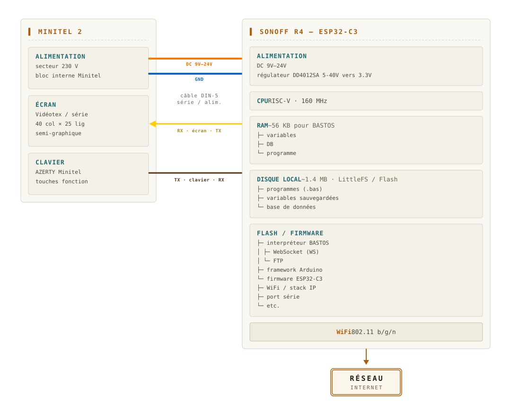
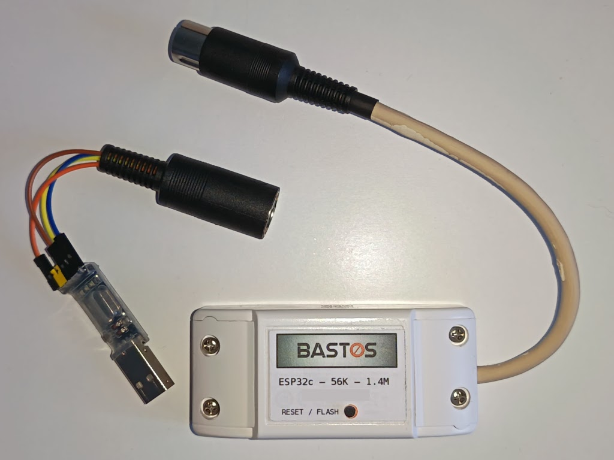
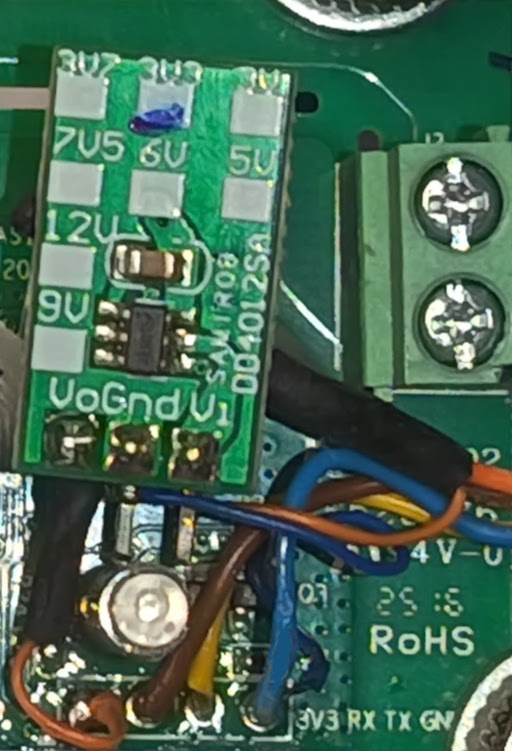
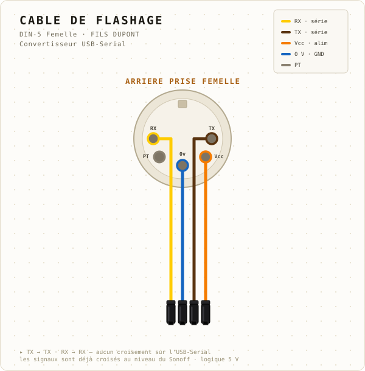
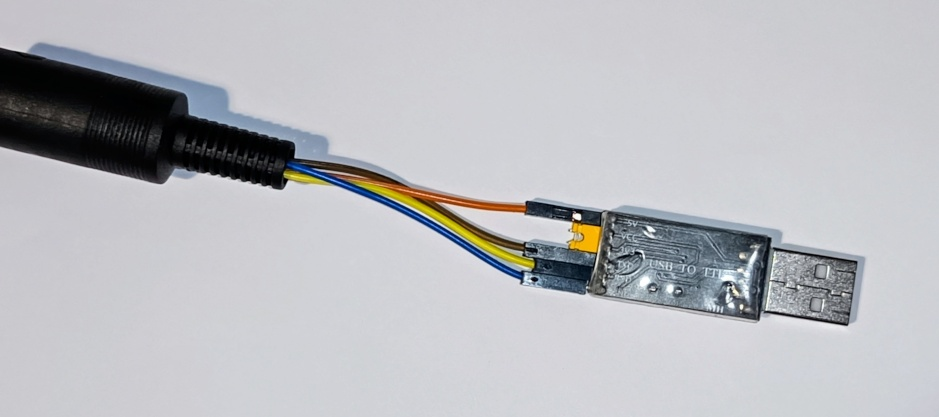

# Architecture

## Vue logique

BASTOS-S est un interpréteur BASIC qui s’exécute sur le processeur d'un
interrupteur Wi-Fi Sonoff. Le langage est adapté aux spécificités du Minitel,
notamment les commandes d'affichage qui produisent des séquences Videotex
ensuite transmises au Minitel par la prise péri-informatique. BASTOS dispose de
commandes pour se connecter à Wi-Fi et à aux services Minitel aujourd'hui
disponibles sur Internet. En mode connecté, BASTOS agit comme une passerelle
bi-directionnelle entre le service et le Minitel.



## Vue physique

BASTOS-S est basé sur un interrupteur Wi-Fi du commerce, le Sonoff Basic, dont
les révisions R2, R3 et R4 sont supportées. Le modèle **SV** (_Safe Voltage_)
est également supporté, mais il ne dispose pas de boîtier. Le montage est
toutefois plus simple sur ce modèle puisqu'il dispose d'un régulateur intégré.

Les caractéristiques qui nous intéressent sur ces modules sont :

- L'alimentation et le lien série qui sont directement accessibles sur la carte
  par des trous traversants
- La possibilité de flasher un nouveau _firmware_ depuis un PC via un simple
  adaptateur USB-Serial
- Le boîtier, présentant un bouton poussoir et une LED
- La possibilité d'utiliser le lien série, Le Wi-Fi, le bouton poussoir et la
  LED par programmation
- L'entrée série RX, bien que 3.3v, est tolérante 5v, c'est à dire "compatible"
  avec la sortie TX du Minitel. De même, la sortie TX à 3.3v sera vue comme un
  niveau haut par le Minitel

L'alimentation du module est par contre contrainte à 3.3v. En exploitation, la
prise péri-informatique fournit, selon les modèles de Minitel, une tension entre
9v et 24v. En phase de flashage du _firmware_, les adaptateurs USB serial du
commerce fournissent généralement deux tensions : 3.3v et 5v. En optant pour un
abaisseur / régulateur vers 3.3v qui accepte en entrée des tensions de 5v à 24v,
il est possible d'intégrer le composant dans le boîtier et de fournir une
interface commune pour les phases d'installation et d'exploitation (figure
[@BASTOS-ALL]).



# Hardware

## Liste du matériel

| Réf. | Prix approx. | Comment. |
|---|---|---|
| DD4012SA à 3.3V | 1€-5€ | 4.7v-40v en entrée, **pas besoin si SV**  |
| Sonoff Basic R4 | 4€-6€ | R2, R3 et SV possibles  |
| CH340G | 1€-5€ | USB Serial / TTL 5v, pour flash depuis PC  |
| DIN-5 Mâle et DIN-5 Femelle | 2€-8€ | Ou câble DIN5 mâle - femelle à couper en deux |
| Câbles de couleur | récup. | Câbles téléphonique, câbles Dupont, etc. |

## Sonoff + Régul. + DIN-5 Mâle

### Schéma

Sur le schéma en figure [@SHEMA-CABLAGE], la prise péri-informatique est
représentée. Cette vue correspond également à la vue arrière de la prise DIN-5
Mâle, côté soudure, destinée à s'enficher dans la prise péri-informatique. Il
suffit donc de suivre simplement le schéma pour réaliser le montage.

Une attention particulière aux fils TX et RX : Le fil marron, TX du Minitel, est
soudé sur RX du Sonoff, et le fil jaune, RX du Minitel, sur TX du Sonoff. On
réalise au niveau de la carte le croisement de la connexion série.


### Exemple

Dans l'exemple d'assemblage en figure [@SOUDURE-R4], on a placé le régulateur de
façon à ce qu'il entre dans le boîtier (fig. [@BASTOS-ALL]).



TODO: Ajouter un exemple avec SV

## USB Serial + DIN-5 Femelle

### Schéma

La prise DIN-5 femelle est câblée avec des fils Dupont femelles afin de la
relier aux pattes d'un convertisseur série USB vers TTL. Ce câble +
convertisseur permet de relier le Sonoff à un PC, principalement pour installer
le _firmware_ par la procédure de flashage.

Les fils TX (marron) et RX (jaune) sont raccordés aux pattes de mêmes noms sur
le convertisseur. Nul n'est besoin de les croiser ici, puisqu'ils sont déjà
croisés au niveau de la carte Sonoff.

L'alimentation fournie par le convertisseur doit être prise sur le 5v, car elle
est convertie par le régulateur en 3.3v avant d'atteindre le Sonoff. Les niveaux
TX et RX peuvent être 3.3v ou 5v.



### Exemple



# Firmware

## Pré-requis

- `esptool` doit être accessible dans le `PATH`, l'installer au besoin avec
`sudo apt install esptool`
- L'utilisateur doit appartenir au groupe `dialout` pour ouvrir les ports série
- Relier le boîtier et le câble de flashage en connectant les prises DIN-5 mâle
  et femelle
- Brancher les fils Dupont sur l'adaptateur USB Serial (CP2102, CH340, FTDI en
  mode 5v)

## Installation

Récupérer `sonoff-flash.tgz` par FTP depuis le PC de flash. Cette archive est
auto-suffisante pour flasher un Sonoff sans avoir à compiler les sources.

```bash
$ curl -o sonoff-flash.tgz "ftp://anonymous:@abasty-retro.fr:2121/firmware/sonoff-flash.tgz"
$ tar -xzf sonoff-flash.tgz
```

**Mise en mode flash** : Maintenir le bouton du Sonoff enfoncé pendant 3
secondes tout en branchant la prise USB sur le PC. En mode flash, la LED est
allumée faiblement, elle ne clignote pas.

Lancer l'installation du _firmware_ :

```bash
# Détection automatique du port et du modèle (R2/R3/SV ou R4)
$ ./flash.sh

# Ou en spécifiant le modèle explicitement
$ ./flash.sh r2       # Sonoff Basic R2/R3/SV (ESP8266)
$ ./flash.sh r4       # Sonoff Basic R4 (ESP32-C3)

# Si plusieurs adaptateurs USB-UART sont connectés, préciser le port
$ PORT=/dev/ttyUSB1 ./flash.sh
```

Exemple sur un Sonoff Basic R4 :

```
$ ./flash.sh
[21:14:55] Using port: /dev/ttyUSB0
[21:14:55] No target specified, detecting chip...
[21:14:55] Detected chip: esp32c3
[21:14:55] Flashing Sonoff R4 (ESP32-C3) on /dev/ttyUSB0...
esptool.py v4.7.0
Serial port /dev/ttyUSB0
Connecting...
Chip is ESP32-C3 (QFN32) (revision v0.4)
Features: WiFi, BLE, Embedded Flash 4MB (XMC)
Crystal is 40MHz
MAC: 24:ec:4a:cd:32:54
Stub is already running. No upload is necessary.
Changing baud rate to 460800
Changed.
Configuring flash size...
Flash will be erased from 0x00000000 to 0x00003fff...
Flash will be erased from 0x00008000 to 0x00008fff...
Flash will be erased from 0x0000e000 to 0x0000ffff...
Flash will be erased from 0x00010000 to 0x000e6fff...
Compressed 12464 bytes to 9065...
Wrote 12464 bytes (9065 compressed) at 0x00000000 in 0.5 seconds (effective 219.4 kbit/s)...
Hash of data verified.
Compressed 3072 bytes to 146...
Wrote 3072 bytes (146 compressed) at 0x00008000 in 0.1 seconds (effective 389.7 kbit/s)...
Hash of data verified.
Compressed 8192 bytes to 47...
Wrote 8192 bytes (47 compressed) at 0x0000e000 in 0.1 seconds (effective 554.7 kbit/s)...
Hash of data verified.
Compressed 877728 bytes to 530755...
Wrote 877728 bytes (530755 compressed) at 0x00010000 in 15.2 seconds (effective 460.8 kbit/s)...
Hash of data verified.

Leaving...
Hard resetting via RTS pin...
[21:15:14] ✓ Done.
```

Une fois le _firmware_ installé, débrancher l'ensemble du PC, dissocier les
prises DIN-5 et connecter le Sonoff sur la prise péri-informatique à l'arrière
du Minitel. Allumer le Minitel (interrupteur sur M1B ou touche "Veille" sur M2),
vérifier que la LED du Sonoff clignote une fois par seconde et qu'elle se
stabilise au bout de 3 secondes environ.

Au premier démarrage, BASTOS formate la partition dédiée au stockage puis
l'écran affiche le message `BASTOS xxK Microcontroller (v1) ...`. Le terminal
est alors prêt pour recevoir des ordres en Basic !

Entrer et exécuter le petit programme suivant pour s'assurer que tout marche
correctement :

```basic
10 PRINT "Bonjour"
20 PAUSE 500
30 GOTO 10
RUN
```

Pour arrêter le programme, appuyer deux fois sur la touche Esc.

::: Note
Si le Minitel est en mode répertoire, la combinaison de touches Fnct + Sommaire
permet de revenir sur le mode terminal.

Certains Minitels sont bloqués par un mot de passe. On peut réinitialiser
l'EEPROM pour supprimer ce mot de passe avec les touches Fcnt T + I, directement
après la mise sous tension ou en sortie de veille.
:::
