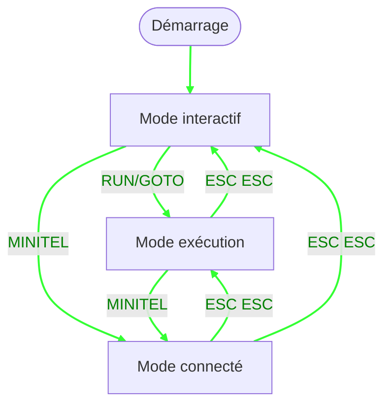

# Manuel du langage BASTOS

## Présentation

### Matériel

BASTOS-S est un ordinateur composé de deux éléments reliés par un câble série DIN-5 :

- **Terminal Minitel** (Minitel 1B, Minitel 2 ou Magis Club) : fournit l'écran Vidéotex (40 colonnes × 25 lignes avec affichage semi-graphique), le clavier AZERTY avec touches de fonction, et l'alimentation électrique via la prise péri-informatique.

- **Module SonOff Basic** (R2, R3 ou R4) équipé d'un microcontrôleur esp8266 ou esp32c (ESP32-C3) :
  - CPU RISC-V 160 MHz (R4) ou Tensilica Xtensa 80 MHz (R2/R3)
  - RAM : ~56 KB pour BASTOS sur R4, ~32 KB sur R2/R3 (variables, base de données, programme)
  - Disque local : ~1,4 MB sur R4, ~512 KB sur R2/R3 (LittleFS sur Flash) pour les programmes (.bas), les variables sauvegardées et la base de données
  - WiFi 802.11 b/g/n pour la connexion Internet
  - Port série : 1200 et 4800 bps (Minitel 1B), jusqu'à 9600 bps (Minitel 2 et Magis Club)

**BASTOS-EDI** est un environnement de développement intégré qui s'exécute dans un conteneur Docker. Il comprend l'interpréteur BASTOS accessible via WebSocket, un émulateur Minitel qui s'y connecte, et un éditeur avec coloration syntaxique. BASTOS-EDI permet de développer et tester des programmes sur PC via navigateur web. Les programmes ainsi développés peuvent être transférés sur BASTOS-S par FTP.

### Le langage BASTOS

BASTOS est un dialecte BASIC conçu spécifiquement pour fonctionner sur terminal Minitel via liaison série. Les programmes sont composés de lignes numérotées exécutées dans l'ordre ; la ligne 0, ou une ligne sans numéro, est interprétée immédiatement (mode interactif).

```basic
10 PRINT "Bonjour !"
20 PAUSE 1000
30 GOTO 10
```

Le langage offre les capacités suivantes :

- **Contrôle du Minitel** : affichage Vidéotex, positionnement curseur, attributs (couleurs, taille, clignotement), semi-graphique
- **Stockage local** : sauvegarde et chargement de programmes et variables sur le disque local (LittleFS)
- **Base de données** : stockage clé/valeur persistant avec les commandes `GET`, `PUT`, `DB`
- **Connectivité Internet** :
  - Connexion WiFi (commande `WIFI`)
  - Accès aux serveurs Minitel via TCP ou WebSockets (commande `MINITEL`)
  - Transfert de fichiers via FTP (commande `FTP`)
- **Fonctions mathématiques** : trigonométrie, logarithmes, racine carrée, aléatoire
- **Tableaux** : variables dimensionnées avec `DIM`
- **Structures de contrôle** : boucles `FOR`/`NEXT`, branchements `IF`/`THEN`, `GOTO`, `GOSUB`/`RETURN`

---

## Modes de BASTOS

BASTOS dispose de trois modes opérationnels :

- **Mode interactif** : Les lignes entrées sont interprétées immédiatement. Si
  une ligne possède un numéro, elle est enregistrée dans le programme. C'est le
  mode d'entrée des commandes et d'édition des lignes de programme.

- **Mode exécution** : Un programme est en train de s'exécuter (lancé avec `RUN`
  ou `GOTO`). Le clavier peut être lu avec `INPUT`, `VKEY` et `INKEY$`. L'écran
  est contrôlé par `PRINT` et les commandes TTY. Appuyer deux fois sur ESC permet
  de sortir du mode exécution et de revenir au mode interactif.

- **Mode connecté** : BASTOS est connecté à un serveur via la commande `MINITEL`.
  Les entrées clavier sont envoyées au serveur, et l'écran affiche la réponse du
  serveur. Appuyer deux fois sur ESC permet de sortir du mode connecté et de
  revenir au mode précédent (soit exécution, soit interactif).



---

## Commandes du programme

| Commande | Description |
|----------|-------------|
| `RUN` | Exécuter depuis la première ligne |
| `RUN numligne` | Exécuter depuis une ligne précise |
| `RUN "fichier.bas"` | Charger et exécuter un programme ASCII |
| `RUN "fichier.bst", numligne` | Charger et exécuter un programme binaire et ses variables depuis une ligne |
| `LIST` | Lister 20 lignes depuis la position courante |
| `LIST numligne` | Lister 20 lignes depuis `numligne` |
| `LIST numligne, nombre` | Lister `nombre` lignes depuis `numligne` |
| `LL` | Identique à `LIST` |
| `NEW` | Supprimer toutes les lignes du programme et les variables |
| `CLEAR` | Effacer les variables et stopper l'exécution |
| `END` | Terminer le programme et effacer les variables |
| `STOP` | Suspendre l'exécution |
| `CONT` | Reprendre après `STOP` |
| `SAVE "fichier.bas"` | Sauvegarder le programme en ASCII |
| `SAVE "fichier.bst"` | Sauvegarder le programme et les variables en binaire |
| `SAVE "fichier.var"` | Sauvegarder les variables uniquement |
| `LOAD "fichier.bas"` | Charger un programme ASCII |
| `LOAD "fichier.bst"` | Charger le programme et les variables depuis un fichier binaire |
| `LOAD "fichier.var"` | Charger les variables uniquement |
| `ERASE "fichier"` | Supprimer un fichier |
| `CAT` | Lister les fichiers locaux |
| `FREE` | Afficher l'utilisation mémoire |
| `RESET` | Réinitialiser le système |
| `BASTOS` | Afficher la version et réinitialiser les attributs écran par défaut |

---

## Entrées / Sorties

### Sortie vers écran

La commande `PRINT` affiche des expressions à l'écran, suivies d'un saut de
ligne. `?` est un raccourci pour `PRINT`.

```basic
PRINT expr [, expr ...]      ' Espace entre les éléments
PRINT expr ; expr            ' Pas d'espace entre les éléments
PRINT                        ' Afficher une ligne vide
? expr                       ' Identique à PRINT expr
```

Un `;` en fin de ligne supprime le saut de ligne final :

```basic
10 PRINT "Entrez une valeur : ";
20 INPUT n
```

Les expressions numériques et les chaînes peuvent être mélangées librement :

```basic
PRINT "Résultat : "; a * 2
PRINT "Nom : " n$ ", âge : " a
```

Positionner l'affichage avec `AT ligne, col` :

```basic
AT 5, 10; "Bonjour"
```

### Contrôle de l'écran du Minitel

L'écran dispose de deux modes d'affichage : **Vidéotex (40 colonnes)** et
**Téléinformatique (80 colonnes)**. La ligne 0 est une ligne d'état ; la zone
d'affichage comporte 24 lignes en dessous. L'accès à la ligne 0 avec `LINE0`
(équivalent à `AT 0,1`) sauvegarde la position courante du curseur et les
attributs. Pour quitter la ligne 0 et retourner à la zone d'affichage, utiliser
`AT` ou `"\n"` (saut de ligne) ; `"\n"` restaure à la fois la position
sauvegardée et les attributs.

Les caractères proviennent de deux jeux : **G0 (ASCII)** pour le texte régulier,
et **G1 (semi-graphiques)** pour les graphiques à base de pixels. En G0, les
attributs sont soit locaux (INK, INVERSE, FLASH, SIZE) soit globaux (PAPER,
UNDERLINE) ; les attributs globaux doivent être précédés d'un séparateur espace.
En G1, tous les attributs sont locaux et ne nécessitent pas de séparateur ;
cependant, SIZE et INVERSE ne sont pas supportés, et UNDERLINE gère les
semi-graphiques disjoints.

Les fonctions TTY renvoient une chaîne contenant la séquence d'échappement
correspondante. Utilisées comme instruction, elles se comportent comme `PRINT
...; ` (émettent la séquence sans saut de ligne final). Utilisées comme
expression, elles peuvent être affectées ou intégrées dans une chaîne :

```basic
CLS                      ' instruction : envoie la séquence d'effacement écran
c$ = CLS                 ' expression : stocke la séquence dans c$
PRINT INK 3 "bonjour"    ' en ligne : changer la couleur puis afficher
m$ = AT 10, 13           ' construire une chaîne avec positionnement
m$ = m$ + "hi"
```

En mode Videotex (MODE 0 ou MODE 1), les fonctions TTY émettent des séquences
Vidéotex. En mode téléinformatique (MODE 2), elles émettent des séquences CSI
(`ESC [ ...`).

#### Écran

```basic
CLS                  ' Effacer l'écran
CLEOL                ' Effacer jusqu'à la fin de ligne
CURSOR n             ' 0=masquer, 1=afficher le curseur
BEEP                 ' Émettre un bip
MODE n               ' Mode écran : ≤1 = 40 cols Videotex, ≥2 = 80 cols téléinformatique
LINE0                ' Placer le curseur en ligne 0, colonne 1 (ligne d'état)
ECHO n               ' 0=écho désactivé, 1=écho activé
G0                   ' Passer au jeu de caractères ASCII
G1                   ' Passer au jeu de caractères semi-graphiques
SCROLL 0             ' Mode page
SCROLL 1             ' Mode rouleau
SCROLL               ' En mode rouleau, scrolle vers le haut
SCROLL UP            ' En mode rouleau, scrolle vers le haut
SCROLL DOWN          ' En mode rouleau, scrolle vers le bas
INS LINE             ' Insérer une ligne
DEL LINE             ' Supprimer une ligne
DEL CHAR             ' Supprimer un caractère
```

Exemple illustrant `DEL CHAR` :

```basic
10 CLS
20 FOR i = 1 TO 24
30 PRINT REP$ 40, "*";
40 NEXT i
50 AT 12, 15
60 PRINT ">>> DEL CHAR <<<"
70 PAUSE 1000
80 AT 12, 20
90 FOR i = 1 TO 20
100 DEL CHAR
110 PAUSE 100
120 NEXT i
```

Ce programme remplit l'écran d'astérisques (lignes 10-40), affiche un message au
centre (lignes 50-60), puis positionne le curseur ligne 12, colonne 20 et
supprime 20 caractères consécutifs, créant un « trou » visible dans l'affichage.

#### Positionnement du curseur

```basic
AT ligne, col
```

Lignes et colonnes sont indexées à partir de 1.

En mode Videotex, les mouvements relatifs du curseur peuvent être insérés dans
les chaînes par leur code hexadécimal :

```basic
PRINT "Bonjour\x08\x08Hi"  ' Reculer deux fois, afficher "Hi"
```

| Code | Hexa | Déplacement |
|------|------|-------------|
| 8 | `\x08` | Gauche (retour arrière) |
| 9 | `\x09` | Droite (tabulation) |
| 10 | `\x0a` | Bas (saut de ligne) |
| 11 | `\x0b` | Haut (tabulation verticale) |

Exemple de dessin d'un cadre avec les caractères semi-graphiques G1 :

```basic
10 CLS
30 REM "Cadre 20x10 au centre"
40 x = 10
50 y = 7
60 w = 20
70 h = 10
80 REM "Coin haut gauche"
90 AT y, x
100 PRINT G1 "7";
110 REM "Ligne horizontale haut"
120 FOR i = 1 TO w - 2
130 PRINT "\x23";
140 NEXT i
150 REM "Coin haut droit"
160 PRINT "k"
170 REM "Lignes verticales"
180 FOR i = 1 TO h - 2
190 AT y + i, x
200 PRINT G1; "5";
210 AT y + i, x + w - 1
220 PRINT G1; "j"
230 NEXT i
240 REM "Coin bas gauche"
250 AT y + h - 1, x ; G1
260 PRINT "u";
270 REM "Ligne horizontale bas"
280 FOR i = 1 TO w - 2
290 PRINT "p";
300 NEXT i
310 REM "Coin bas droit"
320 PRINT "z"
340 AT y + 5, x + 5
350 PRINT "BASTOS"
```

Ce programme dessine un cadre de 20×10 caractères centré à l'écran en utilisant
les caractères semi-graphiques G1. Le cadre utilise : `7` (coin haut gauche),
`\x23` (ligne horizontale haute), `k` (coin haut droit), `5` (ligne verticale
gauche), `j` (ligne verticale droite), `u` (coin bas gauche), `p` (ligne
horizontale basse) et `z` (coin bas droit). Le texte « BASTOS » est affiché à
l'intérieur du cadre en mode G0 (ASCII).

#### Couleurs et attributs

```basic
INK couleur          ' Couleur de premier plan (0-7)
PAPER couleur        ' Couleur d'arrière-plan (0-7) ; sans effet en mode téléinformatique (≥2)
FLASH n              ' 0=normal, 1=clignotant
INVERSE n            ' 0=normal, 1=vidéo inverse
UNDERLINE n          ' 0=normal, 1=souligné
SIZE n               ' 0=normale, 1=double hauteur, 2=double largeur, 3=double taille
```

En mode téléinformatique, `INK 7` active la surbrillance ; `INK 0`–`6` la
désactive. `PAPER` est sans effet. `SIZE` est un attribut local en mode
Videotex.

#### Graphiques

Chaque caractère à l'écran est une matrice semi-graphique de 3 lignes × 2
colonnes de pixels. L'écran (hors ligne 0) comporte 24 lignes de 40 caractères,
soit **80 pixels de largeur × 72 pixels de hauteur**. L'origine **(0, 0) est en
bas à gauche** : x varie de 0–79 (gauche à droite), y varie de 0–71 (bas vers
haut).

```basic
PLOT x, y            ' Allumer un pixel
UNPLOT x, y          ' Éteindre un pixel
TEST x, y            ' Renvoie 1 si le pixel est allumé, 0 sinon
```

#### Vitesse

Définir la vitesse du port série entre SonOff et Minitel :

```basic
SLOW                 ' 1200 bps (défaut)
FAST                 ' 4800 bps
FAST2                ' 9600 bps (Minitel 2 et Magis Club uniquement)
```

### Sortie vers variable

Rediriger l'affichage vers une variable chaîne :

```basic
OUTPUT m$
CLS
AT 10, 13; "*** METEOR ***"
OUTPUT STOP
PRINT m$
```

### Entrée clavier

Lit une valeur au clavier et l'affecte à une variable.

```basic
INPUT variable
INPUT "invite", variable
```

- Pour une variable numérique, attend un nombre.
- Pour une variable chaîne (`$`), lit jusqu'à Entrée.
- Après la saisie, `VKEY` contient le code de la touche de validation.

Codes VKEY des touches de fonction du Minitel :

| Touche | VKEY | Notes |
|--------|------|-------|
| Entrée / ENVOI | 13 | Termine la saisie |
| CORRECTION | 127 | Efface le dernier caractère ; non retourné par INPUT |
| ANNULATION | 1 | Efface toute la saisie ; non retourné par INPUT |
| REPETITION | 2 | Termine la saisie |
| SUITE | 4 | Termine la saisie |
| RETOUR | 5 | Termine la saisie |
| SOMMAIRE | 6 | Termine la saisie |
| GUIDE | 14 | Termine la saisie |

Lecture non bloquante (sans attente) :

```basic
10 k$ = INKEY$
20 IF k$ <> "" THEN PRINT "Touche : " k$
30 PAUSE 100
40 GOTO 10
```

Les touches non imprimables (comme les touches de fonction) ne peuvent pas être
lues comme des caractères réguliers. Utiliser `CODE INKEY$` pour obtenir le code
numérique :

```basic
10 k = CODE INKEY$
20 PAUSE 100
30 IF k = 0 THEN GOTO 10
40 PRINT "Code touche : "; k
50 GOTO 10
```

---

## Types, variables, calculs

### Types

| Type | Suffixe | Stockage |
|------|---------|----------|
| Nombre | aucun | flottant 32 bits |
| Chaîne | `$` | longueur variable |

Les littéraux numériques peuvent être écrits en décimal ou en hexadécimal :

```basic
a = 255
a = 0xff
a = 0x1f
```

Les littéraux chaîne supportent les séquences d'échappement :

| Échappement | Description |
|-------------|-------------|
| `\n` | Saut de ligne |
| `\r` | Retour chariot |
| `\e` | Échap (0x1B) |
| `\xNN` | Octet hexadécimal |

```basic
a$ = "bonjour\n"
b$ = "\e[2J"          ' effacement écran ANSI
c$ = "\x1b\x41\x42"  ' Échap + 'A' + 'B'
```

### Caractères semi-graphiques

Appuyer sur **Ctrl+G** pour basculer entre les jeux G0 (ASCII) et G1
(semi-graphiques). Les caractères tapés en mode G1 sont affichés depuis le jeu
semi-graphique. Les images suivantes montrent la correspondance entre les
caractères G0 au clavier et leurs équivalents semi-graphiques G1 :


### Caractères UTF-8 supportés (conversion Minitel)

Lors du `LOAD` d'un fichier `.bas` ASCII, BASTOS convertit une liste limitée
de caractères UTF-8 en séquences Minitel (préfixe SS2, code `0x19`).

| Glyph | Séquence UTF-8 | Séquence Minitel produite |
|-------|----------------|---------------------------|
| à | `\xC3\xA0` | `\x19Aa` |
| è | `\xC3\xA8` | `\x19Ae` |
| ù | `\xC3\xB9` | `\x19Au` |
| é | `\xC3\xA9` | `\x19Be` |
| â | `\xC3\xA2` | `\x19Ca` |
| ê | `\xC3\xAA` | `\x19Ce` |
| î | `\xC3\xAE` | `\x19Ci` |
| ô | `\xC3\xB4` | `\x19Co` |
| û | `\xC3\xBB` | `\x19Cu` |
| ä | `\xC3\xA4` | `\x19Ha` |
| ë | `\xC3\xAB` | `\x19He` |
| ï | `\xC3\xAF` | `\x19Hi` |
| ö | `\xC3\xB6` | `\x19Ho` |
| ü | `\xC3\xBC` | `\x19Hu` |
| ç | `\xC3\xA7` | `\x19Kc` |
| Ç | `\xC3\x87` | `\x19KC` |
| ß | `\xC3\x9F` | `\x19\x7B` |
| £ | `\xC2\xA3` | `\x19\x23` |
| § | `\xC2\xA7` | `\x19\x27` |
| ° | `\xC2\xB0` | `\x19\x30` |
| ± | `\xC2\xB1` | `\x19\x31` |
| ÷ | `\xC3\xB7` | `\x19\x38` |
| ¼ | `\xC2\xBC` | `\x19\x34` |
| ½ | `\xC2\xBD` | `\x19\x35` |
| ¾ | `\xC2\xBE` | `\x19\x36` |
| Π| `\xC5\x92` | `\x19\x6A` |
| œ | `\xC5\x93` | `\x19\x7A` |

Les autres caractères UTF-8 ne sont pas convertis et restent inchangés.

### Noms de variables

- Numérique : un ou plusieurs caractères, ex. `x`, `compteur`, `total`
- Chaîne : nom terminé par `$`, ex. `nom$`, `buf$`
- Les mots-clés sont insensibles à la casse ; le contenu des chaînes est
  sensible à la casse.

```basic
compteur = 3.14
nom$ = "bonjour"
```

Affectation avec ou sans `LET` :

```basic
LET x = 42
x = 42
```

### Tableaux

Déclarer avec `DIM` avant utilisation. Les tableaux sont indexés à partir de
**1**.

```basic
DIM a(10)             ' tableau 1-D de 10 nombres
DIM m(5, 5)           ' tableau 2-D
DIM s$(10, 25)        ' tableau de chaînes, 25 caractères max chacune
```

Accès :

```basic
a(3) = 99
PRINT a(3)
m(2, 4) = 1.5
s$(1) = "premier"
```

### Opérations sur les chaînes

Les parenthèses sont optionnelles pour toutes les fonctions ; ne les utiliser
que pour grouper.

| Opération | Syntaxe | Exemple |
|-----------|---------|---------|
| Concaténation | `a$ + b$` | `"bonjour" + " monde"` |
| Longueur | `LEN s$` | `LEN "abc"` → `3` |
| Lecture sous-chaîne | `s$(début TO fin)` | `a$(11 TO 13)` |
| Écriture sous-chaîne | `s$(début TO fin) = "..."` | `a$(1 TO 3) = "XYZ"` |
| Code ASCII | `CODE s$` | `CODE "A"` → `65` |
| Caractère | `CHR$ n` | `CHR$ 65` → `"A"` |
| Vers nombre | `VAL s$` | `VAL "3.14"` → `3.14` |
| Vers chaîne | `STR$ n` | `STR$ 42` → `"42"` |
| Recherche | `INDEX s1$, s2$` | `INDEX "bonjour", "on"` → `2` |
| Recherche depuis pos | `INDEX s1$, s2$, début` | |
| Répétition | `REP n, s$` | `REP 3, "-"` → `"---"` |

```basic
PRINT LEN a$
PRINT CODE k$
z$ = CHR$ 0
ia$ = CHR$(CODE a$ & 223)   ' parenthèses pour grouper uniquement
```

Les indices de sous-chaîne utilisent le mot-clé `TO`. `début` vaut `1` par
défaut, `fin` vaut `LEN s$` par défaut :

```basic
a$ = "Alice and Bob"
PRINT a$(11 TO 13)   ' "Bob"
PRINT a$(TO 5)       ' "Alice"  (début omis → 1)
PRINT a$(7 TO)       ' "d Bob"  (fin omise → LEN a$)
PRINT a$(TO)         ' chaîne entière
```

### Opérateurs arithmétiques

| Opérateur | Description |
|-----------|-------------|
| `*` `/` `%` | Multiplication, division, modulo |
| `+` `-` | Addition, soustraction |
| `&` | ET binaire |
| `\|` | OU binaire |

### Opérateurs de comparaison

| Opérateur | Signification |
|-----------|---------------|
| `=` | Égal |
| `<>` | Différent |
| `<` `>` | Inférieur / supérieur |
| `<=` `>=` | Inférieur ou égal / supérieur ou égal |

Le résultat est `1` (vrai) ou `0` (faux).

### Opérateurs logiques

```basic
IF a > 0 AND b > 0 THEN PRINT "les deux positifs"
IF a = 0 OR b = 0 THEN PRINT "l'un est nul"
IF NOT a THEN PRINT "a est nul"
```

### Fonctions mathématiques

Les parenthèses sont optionnelles ; ne les utiliser que pour grouper des
sous-expressions.

| Fonction | Description |
|----------|-------------|
| `ABS x` | Valeur absolue |
| `INT x` | Troncature entière |
| `SGN x` | Signe : -1, 0 ou 1 |
| `SQR x` | Racine carrée |
| `SIN x` `COS x` `TAN x` | Trigonométrie |
| `ASN x` `ACS x` `ATN x` | Trigonométrie inverse |
| `EXP x` | e^x |
| `LN x` | Logarithme naturel |
| `RND` | Flottant aléatoire 0.0–1.0 |
| `PI` | 3.1415926536 |

```basic
PRINT ABS -5
PRINT SQR 2
PRINT INT(a / b)    ' parenthèses pour grouper
```

---

## Structures de contrôle

### REM

Ajouter des commentaires aux lignes de programme. `REM` n'est pas une structure
de contrôle à proprement parler ; elle provoque simplement la poursuite de
l'exécution à la ligne suivante sans effectuer aucune action.

```basic
REM "commentaire"
```

```basic
10 REM "Initialiser les variables"
20 x = 0
30 REM "Ceci est un commentaire"
40 PRINT x
```

### IF / THEN

```basic
IF expression THEN numligne
IF expression THEN instruction
```

```basic
10 INPUT "x : ", x
20 IF x < 0 THEN PRINT "négatif"
30 IF x = 0 THEN 10
40 PRINT "positif"
```

⚠️ **Piège courant** : `IF a > 0 THEN a=a-1` ne fonctionnera pas comme prévu.
`a=a-1` est traité comme une comparaison (« a est-il égal à a-1 ? »), ce qui
évalue à `0` (faux). Utiliser `LET` pour en faire une affectation : `IF a > 0
THEN LET a = a - 1`.

### FOR / NEXT

```basic
FOR var = début TO fin
FOR var = début TO fin STEP pas
NEXT var
```

- `var` doit être une lettre unique `A`–`Z`.
- Un `STEP` négatif compte à rebours.
- Les boucles peuvent être imbriquées.

```basic
10 FOR i = 1 TO 5
20 PRINT i
30 NEXT i

40 FOR i = 10 TO 1 STEP -1
50 PRINT i
60 NEXT i
```

### GOTO

```basic
GOTO numligne
```

```basic
10 PRINT "boucle"
20 PAUSE 1000
30 GOTO 10
```

### GOSUB / RETURN

```basic
GOSUB numligne    ' Appeler un sous-programme
RETURN            ' Retourner à l'appelant
```

Jusqu'à 32 appels imbriqués.

```basic
10 GOSUB 1000
20 END

1000 PRINT "Dans le sous-programme"
1010 RETURN
```

### PAUSE

```basic
PAUSE millisecondes
```

```basic
PRINT "Attendre 2 secondes..."
PAUSE 2000
PRINT "Terminé"
```

---

## Fichiers et Base de données

### Fichiers

Lire le contenu d'un fichier sous forme de chaîne.

```basic
contenu$ = FILE "nomfichier"                  ' Lire tout le fichier
donnees$ = FILE "nomfichier", offset, taille  ' Lire taille octets à offset
```

La fonction `FILE` renvoie le contenu du fichier sous forme de chaîne. La forme
complète lit le fichier entier, tandis que la forme partielle lit un nombre
spécifique d'octets à partir d'un offset donné.

```basic
10 REM "Lire le fichier de configuration"
20 config$ = FILE "config.txt"
30 PRINT config$
```

Exemple de lecture et affichage d'un fichier ligne par ligne avec limite de 39
colonnes :

```basic
10 CLS ;AT 24,1;CURSOR 0
20 FAST
1000 a$=FILE "bastos.txt"
1100 deb=1
1110 fin=INDEX a$,"\n",deb
1120 IF fin<=0 THEN 2000
1130 l$=a$(deb,fin-1)
1140 deb=fin+1
1150 PRINT l$( TO 39)
1210 PAUSE 50
1220 GOTO 1110
2000 CURSOR 1
```

Ce programme lit le fichier entier en mémoire (ligne 1000), puis l'analyse ligne
par ligne en utilisant `INDEX` pour trouver les sauts de ligne (ligne 1110).
Chaque ligne est extraite (ligne 1130) et seuls les 39 premiers caractères sont
affichés (ligne 1150), garantissant un affichage correct sur un écran Vidéotex
de 40 colonnes.

### Base de données

BASTOS dispose d'un magasin clé/valeur organisé en sets numérotés.

```basic
GET set                      ' Renvoie toutes les clés du set sous forme de chaîne
GET set, "clé"               ' Renvoie la valeur associée à une clé
PUT set, "clé", "valeur"     ' Stocker ou mettre à jour une paire clé/valeur
DB LIST set                    ' Lister toutes les entrées du set
DB ERASE set, "clé"            ' Supprimer une entrée par clé du set
```

Les sets sont numérotés à partir de 0. Clés et valeurs sont des chaînes. Les
connexions WiFi, Minitel et FTP utilisent des sets spécifiques pour persister
leur configuration.

```basic
PUT 1, "ville", "Paris"
PRINT GET(1, "ville")    ' "Paris"
```

`GET set` renvoie toutes les clés séparées par `\n`. La dernière clé est
également suivie d'un `\n`. Utiliser `INDEX` pour les parcourir :

```basic
10 keys$ = GET 1
20 pos = 1
30 nl = INDEX(keys$, "\n", pos)
40 IF nl = 0 THEN END
50 key$ = keys$(pos TO nl - 1)
60 PRINT key$ " = " GET(1, key$)
70 pos = nl + 1
80 GOTO 30
```

---

## Réseau

### WiFi

```basic
WIFI SCAN                    ' Scanner les points d'accès disponibles
WIFI "ssid"                  ' Se connecter par SSID (mot de passe demandé si nécessaire)
WIFI START "ssid"            ' Identique (START est l'action par défaut)
WIFI n                       ' Se connecter au réseau numéro n (après SCAN)
WIFI LIST                    ' Lister les réseaux sauvegardés
WIFI STATUS                  ' Afficher l'état de la connexion
WIFI ERASE "ssid"            ' Supprimer un réseau sauvegardé
WIFI STOP                    ' Se déconnecter
```

Après `WIFI SCAN`, les réseaux sont numérotés ; utiliser `WIFI n` pour se
connecter par index.

### Format URN

Les connexions réseau sont identifiées par un URN dont les parties sont séparées par `:` :

```
protocole:hôte:port[:chemin[:login[:motdepasse]]]
```

Pour `ftp`, `login` vaut `anonymous` et `motdepasse` vaut `pat@frites.be` par
défaut si omis.

| Protocole | Description |
|-----------|-------------|
| `tcp` | Socket TCP brut |
| `ws` | WebSocket |
| `ftp` | FTP |

Exemples :

```
tcp:go.minipavi.fr:516
ws:3611.re:80:/ws
ftp:abasty-retro.fr:2121:bastos
ftp:files.example.com:21:/pub:monuser:monmotdepasse
ws:mntl.joher.com:2018:/?echo
```

### Minitel

Connexion à un serveur Minitel (émulation terminal Vidéotex) et sauvegarde
sous un nom.

```basic
MINITEL "nom", "urn"         ' Connecter et sauvegarder sous "nom"
MINITEL START "nom", "urn"   ' Identique (START est l'action par défaut)
MINITEL "nom"                ' Se reconnecter à une connexion sauvegardée
MINITEL LIST                 ' Lister les connexions Minitel sauvegardées
MINITEL ERASE "nom"          ' Supprimer une connexion sauvegardée
```

Exemples :

```basic
MINITEL "minipavi", "tcp:go.minipavi.fr:516"
MINITEL "3615", "ws:3615co.de:80:/ws"
MINITEL "3615"               ' reconnexion par nom sauvegardé
```

### FTP

```basic
FTP "nom", "urn"             ' Connecter et sauvegarder sous "nom"
FTP START "nom", "urn"       ' Identique (START est l'action par défaut)
FTP "nom"                    ' Se reconnecter à une connexion sauvegardée
FTP LIST                     ' Lister les connexions FTP sauvegardées
FTP STATUS                   ' Afficher l'état de la connexion FTP
FTP PUT "fichier"            ' Envoyer un fichier (même nom local et distant)
FTP GET "fichier"            ' Recevoir un fichier (même nom local et distant)
FTP CAT                      ' Lister les fichiers distants
FTP ERASE "nom"              ' Supprimer une connexion sauvegardée
FTP STOP                     ' Se déconnecter
```

Exemple de session :

```basic
10 FTP "bastos", "ftp:abasty-retro.fr:2121:bastos"
20 FTP STATUS
30 FTP GET "snake.bas"
40 FTP STOP
```

---
