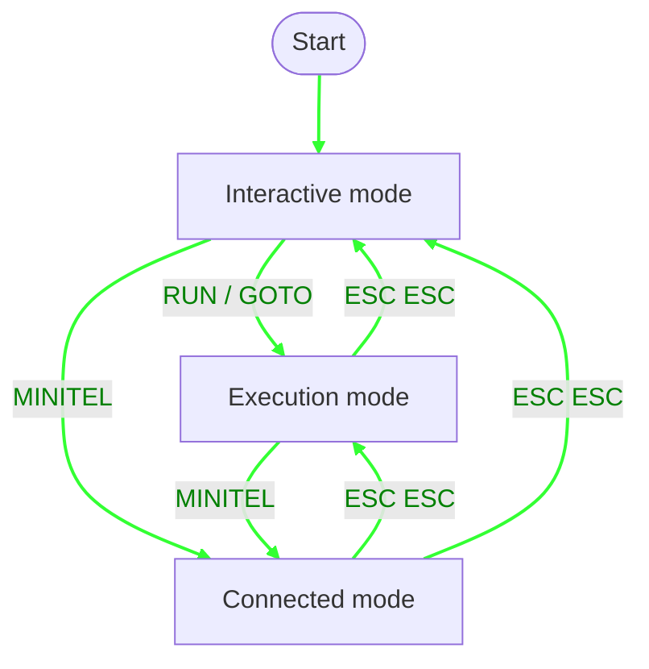

# BASTOS Language Manual

## Presentation

### Hardware

BASTOS-S is a computer system composed of two elements connected by a DIN-5 serial cable:

- **Minitel terminal** (Minitel 1B, Minitel 2, or Magis Club): provides the Videotex screen (40 columns × 25 lines with semi-graphic display), AZERTY keyboard with function keys, and electrical power via the peripheral port.

- **SonOff Basic module** (R2, R3, or R4) equipped with an esp8266 or esp32c (ESP32-C3) microcontroller:
  - RISC-V CPU 160 MHz (R4) or Tensilica Xtensa 80 MHz (R2/R3)
  - RAM: ~56 KB for BASTOS on R4, ~32 KB on R2/R3 (variables, database, program)
  - Local disk: ~1.4 MB on R4, ~512 KB on R2/R3 (LittleFS on Flash) for programs (.bas), saved variables, and database
  - WiFi 802.11 b/g/n for Internet connection
  - Serial port: 1200 and 4800 bps (Minitel 1B), up to 9600 bps (Minitel 2 and Magis Club)

**BASTOS-EDI** is an integrated development environment running in a Docker container. It includes the BASTOS interpreter accessible via WebSocket, a Minitel emulator that connects to it, and an editor with syntax highlighting. BASTOS-EDI allows developing and testing programs on PC via web browser. Programs developed this way can be transferred to BASTOS-S via FTP.

### The BASTOS Language

BASTOS is a BASIC dialect designed specifically to run on Minitel terminals via serial connection. Programs are made of numbered lines executed in order; line 0, or no line number, is interpreted immediately (interactive mode).

```basic
10 PRINT "Hello, World!"
20 PAUSE 1000
30 GOTO 10
```

The language offers the following capabilities:

- **Minitel control**: Videotex display, cursor positioning, attributes (colors, size, blinking), semi-graphics
- **Local storage**: save and load programs and variables on local disk (LittleFS)
- **Database**: persistent key/value storage with `GET`, `PUT`, `DB` commands
- **Internet connectivity**:
  - WiFi connection (`WIFI` command)
  - Access to Minitel servers via TCP or WebSockets (`MINITEL` command)
  - File transfer via FTP (`FTP` command)
- **Mathematical functions**: trigonometry, logarithms, square root, random
- **Arrays**: dimensioned variables with `DIM`
- **Control structures**: `FOR`/`NEXT` loops, `IF`/`THEN`/`ELSE` branching, `GOTO`, `GOSUB`/`RETURN`, named `LABEL`s

---

## BASTOS Modes

BASTOS has three operational modes:

- **Interactive mode**: Entered lines are interpreted immediately. If a line has
  a line number, it is stored in the program. This is the command entry and
  program line editing mode.

- **Execution mode**: A program is running (started with `RUN` or `GOTO`). The
  keyboard can be read with `INPUT`, `VKEY`, and `INKEY$`. The screen is
  controlled by `PRINT` and TTY commands. Press ESC twice to exit execution and
  return to interactive mode.

- **Connected mode**: BASTOS is connected to a server via the `MINITEL` command.
  Keyboard input is sent to the server, and screen output displays the server's
  response. Press ESC twice to exit connected mode and return to the previous
  mode (either execution or interactive).



At startup, if an `autoexec.bas` file exists on the local disk, the command
`RUN "autoexec.bas"` is **automatically** executed.

Example `autoexec.bas` program:

```basic
10 RUN "connect.bas"
```

### Line editing (interactive mode)

In interactive mode, each line being typed can be edited before it is
validated:

- **◄ / ►** (left/right arrows): move the cursor within the line being
  typed, without deleting anything.
- **CORRECTION** (key 127): deletes the character before the cursor.
- **ANNULATION** (key 1): clears the whole line being typed.
- **▲** (up arrow): recalls the last validated line for further editing —
  the last numbered program line (same as `EDIT linenum` would do), or the
  last immediate command typed if no numbered line has been validated
  since. Does nothing if no line has been validated yet, or if the recalled
  numbered line has since been deleted from the program.
- **Validation** (ENVOI/Enter, REPETITION, SUITE, RETOUR, SOMMAIRE or
  GUIDE): submits the line. If it contains a syntax error, BASTOS beeps
  (BEL character) and displays the error, but **stays in edit mode** with
  the typed text preserved, ready to be fixed and resubmitted — the line is
  never lost or silently discarded.
  - **SUITE** validates like ENVOI, but if the validated line is a
    numbered program line, it also automatically loads the **next**
    program line for editing, if there is one.
  - **RETOUR** validates like ENVOI, but automatically loads the
    **previous** program line for editing, if there is one. SUITE and
    RETOUR make it easy to step through and fix a run of lines without
    retyping `EDIT` each time.
- **ESC ESC** (two consecutive presses): abandons the line being typed
  without validating it. If it had been recalled with `EDIT` or the up
  arrow and then modified, the original line in the program is left
  unchanged, even after a failed validation attempt.

| From state | Key(s) | Effect | To state |
|---|---|---|---|
| Empty line | Character, ◄ or ► | insert / move the cursor | Editing |
| Editing | Character, ◄, ► or CORRECTION | modify the line | Editing |
| Editing | ANNULATION | clears the whole line | Empty line |
| Empty line | ▲ | recalls the last validated line | Editing |
| Editing | Validation, valid syntax | the line is stored | Empty line |
| Editing | SUITE, valid syntax, next line exists | the line is stored, the next line is loaded | Editing |
| Editing | RETOUR, valid syntax, previous line exists | the line is stored, the previous line is loaded | Editing |
| Editing | Validation, syntax error | beep + error message | Error (stays in edit mode) |
| Error (stays in edit mode) | Fix, then Validation | the fixed line is stored | Empty line |
| Error (stays in edit mode) | ESC ESC | abandons the line | Empty line |

The `EDIT [linenum]` command has a similar effect to the up arrow, but lets
you explicitly target a program line:

- `EDIT` alone, or `EDIT 0`, edits the **first** line of the program. Does
  nothing if the program is empty.
- `EDIT linenum` edits line `linenum` if it exists, otherwise the first
  **following** existing line (same logic as `GOTO`). Does nothing if no
  line matches (empty program, or `linenum` past the last line).

---

## Program commands

| Command | Description |
|---------|-------------|
| `RUN` | Run from first line |
| `RUN linenumber` | Run from a specific line |
| `RUN "file.bas"` | Load and run ASCII program |
| `RUN "file.bst", linenumber` | Load and run binary program and variables from a specific line |
| `LIST` | List 20 lines from current position |
| `LIST linenum` | List 20 lines starting from `linenum` |
| `LIST linenum, count` | List `count` lines from `linenum` |
| `LL` | Same as `LIST` |
| `EDIT [linenum]` | Recall a program line for editing (see [Line editing](#line-editing-interactive-mode)) |
| `NEW` | Delete all program lines and vriables |
| `CLEAR` | Clear variables and stop execution |
| `END` | Terminate program and clear variables |
| `STOP` | Pause execution |
| `CONT` | Resume after `STOP` |
| `SAVE "file.bas"` | Save program as ASCII |
| `SAVE "file.bst"` | Save program and variables as binary |
| `SAVE "file.var"` | Save variables only |
| `LOAD "file.bas"` | Load ASCII program |
| `LOAD "file.bst"` | Load program and variables from binary |
| `LOAD "file.var"` | Load variables only |
| `ERASE "file"` | Delete file |
| `CAT` | List files |
| `FREE` | Display memory usage |
| `RESET` | Reset system |
| `BASTOS` | Display version info and init default screen attributes |

---

## Input / Output

### Output to screen

The `PRINT` command prints expressions to the screen, followed by a newline. `?`
is a shorthand for `PRINT`.

```basic
PRINT expr [, expr ...]      ' Space between items
PRINT expr ; expr            ' No space between items
PRINT                        ' Print empty line
? expr                       ' Same as PRINT expr
```

Use a trailing `;` to suppress the final newline:

```basic
10 PRINT "Enter value: ";
20 INPUT n
```

Numeric expressions and string variables can be mixed freely:

```basic
PRINT "Result: "; a * 2
PRINT "Name: " n$ ", age: " a
```

Position output with `AT line, col`:

```basic
AT 5, 10; "Hello"
```

### Minitel Screen Control

The screen has two display modes: **Videotex (40 columns)** and
**Téléinformatique (80 columns)**. Line 0 is a status line; the display area
consists of 24 lines below it. Accessing line 0 with `LINE0` (equivalent to
`AT 0,1`) saves the current cursor position and attributes. To exit line 0
and return to the display area, use `AT` or `"\n"` (newline); `"\n"`
restores both the saved position and attributes.

Characters are drawn from two sets: **G0 (ASCII)** for regular text, and **G1
(semi-graphics)** for pixel-based graphics. On G0, attributes are either local
(INK, INVERSE, FLASH, SIZE) or global (PAPER, UNDERLINE); global attributes must
be preceded by a space separator. On G1, all attributes are local and require no
separator; however, SIZE and INVERSE are not supported, and UNDERLINE controls
disjoint semi-graphics.

TTY functions return a string containing the corresponding escape sequence. Used
as a statement, they behave as `PRINT ...; ` (output the sequence with no
trailing newline). Used as an expression, they can be assigned or embedded in a
string:

```basic
CLS                      ' statement: sends clear-screen sequence
c$ = CLS                 ' expression: stores the sequence in c$
PRINT INK 3 "hello"      ' inline: set color then print
m$ = AT 10, 13           ' build a string with positioning
m$ = m$ + "hi"
```

In Videotex mode (MODE 0 or MODE 1), TTY functions emit Videotex sequences. In
80-column mode (MODE 2), they emit CSI sequences (`ESC [ ...`).

#### Screen

```basic
CLS                  ' Clear screen
CLEOL                ' Clear to end of line
CURSOR n             ' 0=hide, 1=show cursor
BEEP                 ' Sound bell
MODE n               ' Screen mode: 0/1 = 40 cols Videotex, ≥2 = 80-column
LINE0                ' Move cursor to line 0, column 1 (status line)
ECHO n               ' 0=echo off, 1=echo on
G0                   ' Switch to ASCII character set
G1                   ' Switch to semi-graphic character set
SCROLL 0             ' Page mode
SCROLL 1             ' Scroll mode
SCROLL               ' In scroll mode, scrolls up
SCROLL UP            ' In scroll mode, scrolls up
SCROLL DOWN          ' In scroll mode, scrolls down
INS LINE             ' Insert line
DEL LINE             ' Delete line
DEL CHAR             ' Delete character
```

`MODE 0` and `MODE 1` both switch to 40-column Videotex mode, but aren't
identical: `MODE 0` sends only the bare column-width switch, while `MODE 1`
also resends the full terminal init sequence (local echo off, scroll mode,
lowercase keyboard, extended keyboard) — the same one sent automatically at
startup. Use `MODE 1` to fully reset the terminal back to its normal state
(for example, after `MODE 2`), and `MODE 0` when only the column width
itself needs to change.

Example demonstrating `DEL CHAR`:

```basic
10 CLS
20 FOR i = 1 TO 24
30 PRINT REP$ 40, "*";
40 NEXT i
50 AT 12, 15
60 PRINT ">>> DEL CHAR <<<"
70 PAUSE 1000
80 AT 12, 20
90 FOR i = 1 TO 20
100 DEL CHAR
110 PAUSE 100
120 NEXT i
```

This program fills the screen with asterisks (lines 10-40), displays a message at
the center (line 50-60), then positions the cursor at line 12, column 20 and
deletes 20 consecutive characters, creating a visible "hole" in the display.

#### Cursor positioning

```basic
AT line, col
```

Lines and columns are 1-indexed.

In Videotex mode, relative cursor movements can be inserted in strings using hex
codes:

```basic
PRINT "Hello\x08\x08Hi"  ' Backspace twice, print "Hi"
```

| Code | Hex | Movement |
|------|-----|----------|
| 8 | `\x08` | Left (backspace) |
| 9 | `\x09` | Right (tab) |
| 10 | `\x0a` | Down (line feed) |
| 11 | `\x0b` | Up (vertical tab) |

Example drawing a frame using G1 semi-graphic characters:

```basic
10 CLS
30 REM "Cadre 20x10 au centre"
40 x = 10
50 y = 7
60 w = 20
70 h = 10
80 REM "Coin haut gauche"
90 AT y, x
100 PRINT G1 "7";
110 REM "Ligne horizontale haut"
120 FOR i = 1 TO w - 2
130 PRINT "\x23";
140 NEXT i
150 REM "Coin haut droit"
160 PRINT "k"
170 REM "Lignes verticales"
180 FOR i = 1 TO h - 2
190 AT y + i, x
200 PRINT G1; "5";
210 AT y + i, x + w - 1
220 PRINT G1; "j"
230 NEXT i
240 REM "Coin bas gauche"
250 AT y + h - 1, x ; G1
260 PRINT "u";
270 REM "Ligne horizontale bas"
280 FOR i = 1 TO w - 2
290 PRINT "p";
300 NEXT i
310 REM "Coin bas droit"
320 PRINT "z"
340 AT y + 5, x + 5
350 PRINT "BASTOS"
```

This program draws a 20×10 character frame centered on screen using G1
semi-graphic characters. The frame uses: `7` (top-left corner), `\x23`
(horizontal top line), `k` (top-right corner), `5` (left vertical line), `j`
(right vertical line), `u` (bottom-left corner), `p` (horizontal bottom line),
and `z` (bottom-right corner). The text "BASTOS" is displayed inside the frame
in G0 (ASCII) mode.

#### Colors and attributes

```basic
INK color            ' Foreground color (0-7)
PAPER color          ' Background color (0-7); no effect in 80-column mode (≥2)
FLASH n              ' 0=off, 1=blinking
INVERSE n            ' 0=normal, 1=inverted
UNDERLINE n          ' 0=off, 1=underlined
SIZE n               ' 0=normal, 1=double height, 2=double width, 3=double size
```

In 80-column mode, `INK 7` enables bold/bright; `INK 0`–`6` disables it. `PAPER`
has no effect. `SIZE` is a local attribute in Videotex mode.

#### Graphics

Each screen character is a semi-graphic matrix of 3 rows × 2 columns of pixels.
The screen (excluding line 0) has 24 lines of 40 characters, giving **80 pixels
wide × 72 pixels tall**. The origin **(0, 0) is at the bottom-left corner**: x
ranges from 0–79 (left to right), y ranges from 0–71 (bottom to top).

```basic
PLOT x, y            ' Set pixel
UNPLOT x, y          ' Clear pixel
TEST x, y            ' Returns 1 if pixel set, 0 otherwise
```

#### Speed

Set the serial port speed between SonOff and Minitel:

```basic
SLOW                 ' 1200 bps (default)
FAST                 ' 4800 bps
FAST2                ' 9600 bps (Minitel 2 and Magis Club only)
```

### Output to variable

Redirect output to a string variable:

```basic
OUTPUT m$
CLS
AT 10, 13; "*** METEOR ***"
OUTPUT STOP
PRINT m$
```

### Keyboard input

Reads a value from the keyboard and assigns it to a variable.

```basic
INPUT variable
INPUT "prompt", variable
```

- For a numeric variable, expects a number.
- For a string variable (`$`), reads until Enter.
- After input, `VKEY` holds the validation key code.

VKEY codes for Minitel function keys:

| Key | VKEY | Notes |
|-----|------|-------|
| Enter / ENVOI | 13 | Ends input |
| CORRECTION | 127 | Deletes last character; not returned by INPUT |
| ANNULATION | 1 | Clears entire input; not returned by INPUT |
| REPETITION | 2 | Ends input |
| SUITE | 4 | Ends input |
| RETOUR | 5 | Ends input |
| SOMMAIRE | 6 | Ends input |
| GUIDE | 14 | Ends input |

Non-blocking key read (no wait):

```basic
10 k$ = INKEY$
20 IF k$ <> "" THEN PRINT "Pressed: " k$
30 PAUSE 100
40 GOTO 10
```

Non-printable keys (like function keys) cannot be read as regular characters.
Use `CODE INKEY$` to get the numeric code:

```basic
10 k = CODE INKEY$
20 PAUSE 100
30 IF k = 0 THEN GOTO 10
40 PRINT "Key code: "; k
50 GOTO 10
```

---

## Types, variables, computations

### Types

| Type | Suffix | Storage |
|------|--------|---------|
| Number | none | 32-bit float |
| String | `$` | Variable length |

Number literals can be written in decimal or hexadecimal:

```basic
a = 255
a = 0xff
a = 0x1f
```

String literals support escape sequences:

| Escape | Description |
|--------|-------------|
| `\n` | Newline |
| `\r` | Carriage return |
| `\e` | Escape (0x1B) |
| `\xNN` | Hexadecimal byte |

```basic
a$ = "hello\n"
b$ = "\e[2J"          ' ANSI clear screen
c$ = "\x1b\x41\x42"  ' Escape + 'A' + 'B'
```

### Semi-graphic characters

Press **Ctrl+G** to toggle between G0 (ASCII) and G1 (semi-graphic) character
sets. Characters typed while in G1 mode are displayed from the semi-graphic set.
The following images show the mapping between G0 keyboard characters and their
G1 semi-graphic equivalents:


### Supported UTF-8 characters (Minitel conversion)

The Minitel keyboard can type all of these characters (accents, symbols,
arrows, line-drawing), but editing a program in BASTOS's built-in line
editor is still far more constrained than in a PC text editor (VSCode, for
example): syntax highlighting, copy/paste, search, even AI assistance. To
write and edit BASTOS programs on a PC with that comfort, these characters
can be typed in their normal UTF-8 form, in an ASCII `.bas` file, with any
text editor: when that file is LOADed, BASTOS automatically converts a
limited set of UTF-8 characters into the equivalent Minitel sequences,
with no action needed from the user.

Accented letters and symbols use the G2 set (SS2 prefix, code `0x19` — a
single-shift, so it doesn't disturb the character set otherwise in
effect). Arrows also use the G2 set the same
way. Line-drawing characters are plain G0 glyphs instead — the same
character set as digits and letters — so they convert to a single byte,
with no shift at all. Two of them (`|` for the middle vertical bar, `_` for
the bottom horizontal bar) are already plain ASCII, so there's nothing to
convert: the same byte already is the Minitel code.

To type a character that isn't directly on the keyboard, most Linux
editors (including VSCode) accept **Ctrl+Shift+U**, followed by the code
point digits, then **Enter** or **Space** — those are the digits listed in
the "Code point" column below. (On Windows: type the digits then **Alt+X**
in editors that support it. On macOS: enable the "Unicode Hex Input"
keyboard layout, then **Option** + digits.)

| Glyph | Code point | UTF-8 sequence | Generated Minitel sequence |
|-------|------------|----------------|----------------------------|
| à | `E0` | `\xC3\xA0` | `\x19Aa` |
| è | `E8` | `\xC3\xA8` | `\x19Ae` |
| ù | `F9` | `\xC3\xB9` | `\x19Au` |
| é | `E9` | `\xC3\xA9` | `\x19Be` |
| â | `E2` | `\xC3\xA2` | `\x19Ca` |
| ê | `EA` | `\xC3\xAA` | `\x19Ce` |
| î | `EE` | `\xC3\xAE` | `\x19Ci` |
| ô | `F4` | `\xC3\xB4` | `\x19Co` |
| û | `FB` | `\xC3\xBB` | `\x19Cu` |
| ä | `E4` | `\xC3\xA4` | `\x19Ha` |
| ë | `EB` | `\xC3\xAB` | `\x19He` |
| ï | `EF` | `\xC3\xAF` | `\x19Hi` |
| ö | `F6` | `\xC3\xB6` | `\x19Ho` |
| ü | `FC` | `\xC3\xBC` | `\x19Hu` |
| ç | `E7` | `\xC3\xA7` | `\x19Kc` |
| Ç | `C7` | `\xC3\x87` | `\x19KC` |
| ß | `DF` | `\xC3\x9F` | `\x19\x7B` |
| £ | `A3` | `\xC2\xA3` | `\x19\x23` |
| § | `A7` | `\xC2\xA7` | `\x19\x27` |
| ° | `B0` | `\xC2\xB0` | `\x19\x30` |
| ± | `B1` | `\xC2\xB1` | `\x19\x31` |
| ÷ | `F7` | `\xC3\xB7` | `\x19\x38` |
| ¼ | `BC` | `\xC2\xBC` | `\x19\x34` |
| ½ | `BD` | `\xC2\xBD` | `\x19\x35` |
| ¾ | `BE` | `\xC2\xBE` | `\x19\x36` |
| Π| `152` | `\xC5\x92` | `\x19\x6A` |
| œ | `153` | `\xC5\x93` | `\x19\x7A` |
| ← | `2190` | `\xE2\x86\x90` | `\x19\x2C` |
| ↑ | `2191` | `\xE2\x86\x91` | `\x19\x2D` |
| → | `2192` | `\xE2\x86\x92` | `\x19\x2E` |
| ↓ | `2193` | `\xE2\x86\x93` | `\x19\x2F` |
| ▏ (vertical, left) | `258F` | `\xE2\x96\x8F` | `\x7B` |
| \| (vertical, middle) | *(keyboard key)* | `\x7C` | `\x7C` (unchanged) |
| ▕ (vertical, right) | `2595` | `\xE2\x96\x95` | `\x7D` |
| ▔ (horizontal, top) | `203E` | `\xE2\x80\xBE` | `\x7E` |
| ─ (horizontal, middle) | `2500` | `\xE2\x94\x80` | `\x60` |
| _ (horizontal, bottom) | *(keyboard key)* | `\x5F` | `\x5F` (unchanged) |

Any other UTF-8 characters are not converted and are kept unchanged.

### Variable names

- Numeric: one or more characters, e.g. `x`, `count`, `total`
- String: name ending with `$`, e.g. `name$`, `buf$`
- Keywords are case-insensitive; string content is case-sensitive.

```basic
count = 3.14
name$ = "hello"
```

Assignment with or without `LET`:

```basic
LET x = 42
x = 42
```

### Arrays

Declare with `DIM` before use. Arrays are **1-indexed**.

```basic
DIM a(10)             ' 1-D array of 10 numbers
DIM m(5, 5)           ' 2-D array
DIM s$(10, 25)        ' Array of strings, up to 25 chars each
```

Access:

```basic
a(3) = 99
PRINT a(3)
m(2, 4) = 1.5
s$(1) = "first"
```

### String operations

Parentheses are optional for all functions; use them only for grouping.

| Operation | Syntax | Example |
|-----------|--------|---------|
| Concatenation | `a$ + b$` | `"hello" + " world"` |
| Length | `LEN s$` | `LEN "abc"` → `3` |
| Substring read | `s$(start TO end)` | `a$(11 TO 13)` |
| Substring write | `s$(start TO end) = "..."` | `a$(1 TO 3) = "XYZ"` |
| ASCII code | `CODE s$` | `CODE "A"` → `65` |
| Character | `CHR$ n` | `CHR$ 65` → `"A"` |
| To number | `VAL s$` | `VAL "3.14"` → `3.14` |
| To string | `STR$ n` | `STR$ 42` → `"42"` |
| Find | `INDEX s1$, s2$` | `INDEX "hello", "ll"` → `3` |
| Find from pos | `INDEX s1$, s2$, start` | |
| Repeat | `REP n, s$` | `REP 3, "-"` → `"---"` |

```basic
PRINT LEN a$
PRINT CODE k$
z$ = CHR$ 0
ia$ = CHR$(CODE a$ & 223)   ' parentheses for grouping only
```

Substring indices use the `TO` keyword. `start` defaults to `1`, `end` defaults
to `LEN s$`:

```basic
a$ = "Alice and Bob"
PRINT a$(11 TO 13)   ' "Bob"
PRINT a$(TO 5)       ' "Alice"  (start omitted → 1)
PRINT a$(7 TO)       ' "d Bob"  (end omitted → LEN a$)
PRINT a$(TO)         ' whole string
```

### Arithmetic operators

| Operator | Description |
|----------|-------------|
| `*` `/` `%` | Multiply, divide, modulo |
| `+` `-` | Add, subtract |
| `&` | Bitwise AND |
| `\|` | Bitwise OR |

### Comparison operators

| Operator | Meaning |
|----------|---------|
| `=` | Equal |
| `<>` | Not equal |
| `<` `>` | Less / greater than |
| `<=` `>=` | Less / greater or equal |

Result is `1` (true) or `0` (false).

### Logical operators

```basic
IF a > 0 AND b > 0 THEN PRINT "both positive"
IF a = 0 OR b = 0 THEN PRINT "one is zero"
IF NOT a THEN PRINT "a is zero"
```

### Math functions

Parentheses are optional; use them only for grouping sub-expressions.

| Function | Description |
|----------|-------------|
| `ABS x` | Absolute value |
| `INT x` | Truncate to integer |
| `SGN x` | Sign: -1, 0, or 1 |
| `SQR x` | Square root |
| `SIN x` `COS x` `TAN x` | Trigonometry |
| `ASN x` `ACS x` `ATN x` | Inverse trig |
| `EXP x` | e^x |
| `LN x` | Natural logarithm |
| `RND` | Random float 0.0–1.0 |
| `PI` | 3.1415926536 |

```basic
PRINT ABS -5
PRINT SQR 2
PRINT INT(a / b)    ' parentheses for grouping
```

`RAND seed` seeds the pseudo-random generator `RND` reads from, so a
program can reproduce the same sequence of `RND` values across runs (handy
for testing, or for a game that wants a repeatable level from a given
seed):

```basic
RAND 42
```

---

## Control structures

### Multiple statements on one line (`:`)

Several statements can be placed on the same line, separated by `:`:

```basic
10 a = 1 : b = 2 : c = 3
20 PRINT a : PRINT b : PRINT c
```

With `IF`, the statement (or the `:`-separated run of statements) after
`THEN` only runs if the condition is true; otherwise **the rest of the
line** is skipped entirely:

```basic
10 IF x > 0 THEN PRINT "positive" : counter = counter + 1
```

A whole `FOR`/`NEXT` loop can also fit on a single line:

```basic
10 FOR i = 1 TO 3 : PRINT i : NEXT
```

### REM and comments (`'`)

`REM` adds a comment on its own line. It is not a control structure per se;
it simply causes execution to continue to the next line without performing
any action.

```basic
REM "comment"
```

```basic
10 REM "Initialize variables"
20 x = 0
30 REM "This is a comment"
40 PRINT x
```

A single quote `'` also introduces a comment, but at the end of a line,
after one or more statements: everything after `'` through the end of the
line is ignored at runtime, including any `:` it contains. The comment is
kept in the stored program and reappears verbatim with `LIST`.

```basic
10 x = 1 ' initialize x
20 PRINT x : PRINT x * 2 ' print x then its double
```

### IF / THEN / ELSE

```basic
IF expression THEN linenumber
IF expression THEN statement [: statement ...]
IF expression THEN ... ELSE linenumber
IF expression THEN ... ELSE statement [: statement ...]
```

```basic
10 INPUT "x: ", x
20 IF x < 0 THEN PRINT "negative" ELSE PRINT "positive or zero"
30 IF x = 0 THEN 10
```

`ELSE` is optional. When present, it introduces the statement(s) to run when
the `IF` test is false; when absent, a false test simply skips to the end of
the line, as before. Only one of the two clauses ever runs — once a true
`THEN` clause finishes (including any further `:`-separated statements), a
following `ELSE` on the same line is always skipped, and vice versa.

`ELSE`, like `THEN`, accepts either a bare line number (short for `GOTO
linenumber`) or one or more `:`-separated statements:

```basic
10 IF a = 0 THEN 100 ELSE 200
```

A bare target on `THEN`/`ELSE` can also be a quoted [label](#label) name
(short for `GOTO "name"`), resolved the same way — see LABEL below:

```basic
10 IF a = 0 THEN "zero" ELSE "nonzero"
```

`IF` statements can be nested on the same line via `:`; each `ELSE` binds to
its nearest still-unmatched `IF`, the same way most other languages resolve
this:

```basic
10 IF a = 1 THEN PRINT "a": IF b = 1 THEN PRINT "b too" ELSE PRINT "not b"
```

`ELSE` cannot be directly followed by another `IF` — the clause after `ELSE`
(like the clause after `THEN`) must start with a plain statement, not `IF`
itself. To test a third case, put a harmless placeholder statement right
after `ELSE`, then chain the nested `IF` onto it with `:` — `LET x=x` (an
assignment with no effect) is a common choice:

```basic
10 IF x < 0 THEN PRINT "negative" ELSE LET x=x: IF x = 0 THEN PRINT "zero" ELSE PRINT "positive"
```

This prints exactly one of the three labels. If `x < 0` is true, `THEN`
prints "negative" and the whole `ELSE` (including the nested `IF`) is
skipped to the end of the line. If `x < 0` is false, execution jumps
straight to `ELSE`, runs the harmless `LET x=x`, then falls through to the
nested `IF x = 0 ... ELSE ...`, which decides between "zero" and
"positive".

⚠️ **Common pitfall**: `IF a > 0 THEN a=a-1` does not do what it looks like —
the same trap exists right after `ELSE`. BASTOS does not read `a=a-1` as an
assignment, but as a comparison (is `a` equal to `a-1`?), which evaluates to
`0` or `1`. That result is then treated exactly like the shortcut line
number of a `GOTO` (the same mechanism as `THEN 10`): the program actually
jumps to line `0` or `1`, which is neither an assignment nor a harmless
no-op. To write a real assignment after `THEN`/`ELSE`, use `LET` explicitly:
`IF a > 0 THEN LET a = a - 1`.

### FOR / NEXT

```basic
FOR var = start TO end
FOR var = start TO end STEP step
NEXT var
NEXT
```

- `var` must be a single letter `A`–`Z`.
- Negative `STEP` counts down.
- Loops may be nested.
- `NEXT` with no variable always closes the innermost loop currently
  active.
- `NEXT var` must name that same innermost loop; naming an outer loop that
  hasn't been closed yet is an error.

```basic
10 FOR i = 1 TO 5
20 PRINT i
30 NEXT i

40 FOR i = 10 TO 1 STEP -1
50 PRINT i
60 NEXT i
```

```basic
10 FOR i = 1 TO 2
20   FOR j = 1 TO 2
30     PRINT i; j
40   NEXT           ' closes the j loop (the innermost one)
50 NEXT i            ' closes the i loop
```

### GOTO

```basic
GOTO linenumber
GOTO "label"
```

```basic
10 PRINT "loop"
20 GOTO 10
```

`GOTO` also accepts a label name in quotes instead of a line number — see
[LABEL](#label) below.

### GOSUB / RETURN

```basic
GOSUB linenumber    ' Call subroutine
GOSUB "label"        ' Call subroutine by label name
RETURN              ' Return to caller
```

Up to 32 nested calls.

```basic
10 GOSUB 1000
20 END

1000 PRINT "In subroutine"
1010 RETURN
```

### LABEL

```basic
LABEL "name"
LABEL START
```

Gives a line a name so `GOTO`/`GOSUB` — and a bare target on `THEN`/`ELSE`
(see [IF / THEN / ELSE](#if--then--else)) — can jump to it without knowing
its line number — handy for a program that gets renumbered or edited over
time.

```basic
1000 LABEL "decadix"
1010 PRINT "In decadix"
1020 RETURN
```

```basic
10 GOSUB "decadix"
20 END
```

The first time a given label name is used as a jump target (`GOTO`/`GOSUB`,
or a bare `THEN`/`ELSE` target), BASTOS looks for the matching `LABEL
"name"` line — either because it already ran (the normal case, since
`LABEL` executes like any other statement, in program order), or if it
hasn't run yet, by scanning the whole program for it. Either way, the line
number is then remembered, so later jumps to the same label are instant. A
label must be the very first statement on its line (`1000 LABEL
"decadix"`, optionally followed by more `:`-separated statements) to be
found by that scan — used elsewhere on a line, `LABEL` still works when it
actually runs, but won't be found ahead of time. Targeting a label that
doesn't exist anywhere in the program is an error.

`LABEL START` scans the whole program in a single pass and remembers every
`LABEL "name"` line it finds, up front — useful at the start of a program
to avoid paying the scan cost on the first jump to each label:

```basic
10 LABEL START
20 GOSUB "decadix"
30 END

1000 LABEL "decadix"
1010 PRINT "In decadix"
1020 RETURN
```

A plain `RUN` clears all variables, including any remembered label
positions (from either form of `LABEL`) — so editing a program and then
editing a line that carries a `LABEL`, without an intervening `RUN`, can
leave a stale jump target behind until the next `RUN`.

`CLEAR`/`END` also clear remembered label positions, the same as any other
variable — a label is just a variable in its own namespace. Likewise,
`FREE`'s variable count includes labels.

### PAUSE

```basic
PAUSE milliseconds
```

```basic
PRINT "Wait 2 seconds..."
PAUSE 2000
PRINT "Done"
```

---

## Files and Database

### Files

Read file content as a string.

```basic
content$ = FILE "filename"              ' Read entire file
data$ = FILE "filename", offset, size   ' Read size bytes at offset
```

The `FILE` function returns the file content as a string. The full form reads
the entire file, while the partial form reads a specific number of bytes
starting at a given offset.

```basic
10 REM "Read configuration file"
20 config$ = FILE "config.txt"
30 PRINT config$
```

Example reading and displaying a file line by line with 39-column limit:

```basic
10 CLS ;AT 24,1;CURSOR 0
20 FAST
1000 a$=FILE "bastos.txt"
1100 deb=1
1110 fin=INDEX a$,"\n",deb
1120 IF fin<=0 THEN 2000
1130 l$=a$(deb,fin-1)
1140 deb=fin+1
1150 PRINT l$( TO 39)
1210 PAUSE 50
1220 GOTO 1110
2000 CURSOR 1
```

This program reads the entire file into memory (line 1000), then parses it line
by line using `INDEX` to find newlines (line 1110). Each line is extracted
(line 1130) and only the first 39 characters are displayed (line 1150),
ensuring proper display on a 40-column Videotex screen.

### Database

BASTOS provides a simple key/value store organized in numbered sets.

```basic
GET set              ' Returns all keys of the set as a string
GET set, "key"       ' Returns the value associated with a key
PUT set, "key", "value"  ' Store or update a key/value pair
DB LIST set            ' List all entries in set
DB ERASE set, "key"    ' Delete entry by key from set
```

Sets are numbered starting from 0. Keys and values are strings. WiFi, Minitel,
and FTP connections use specific sets to persist their configuration.

```basic
PUT 1, "city", "Paris"
PRINT GET(1, "city")    ' "Paris"
```

`GET set` returns all keys joined by `\n`. Use `INDEX` to iterate over them:

```basic
10 keys$ = GET 1
20 pos = 1
30 nl = INDEX(keys$, "\n", pos)
40 IF nl = 0 THEN END
50 key$ = keys$(pos TO nl - 1)
60 PRINT key$ " = " GET(1, key$)
70 pos = nl + 1
80 GOTO 30
```

---

## Network

### WiFi

```basic
WIFI SCAN                    ' Scan available access points
WIFI "ssid"                  ' Connect by SSID (prompts for password if needed)
WIFI START "ssid"            ' Same as above (START is the default action)
WIFI n                       ' Connect to scanned network number n
WIFI LIST                    ' List saved networks
WIFI STATUS                  ' Show current connection status
WIFI ERASE "ssid"            ' Remove a saved network
WIFI STOP                    ' Disconnect
```

After `WIFI SCAN`, networks are numbered; use `WIFI n` to connect by index.

### URN format

Network connections are identified by a URN whose parts are separated by `:`:

```
protocol:host:port[:path[:login[:password]]]
```

For `ftp`, `login` defaults to `anonymous` and `password` to
`pat@frites.be` if omitted.

| Protocol | Description |
|----------|-------------|
| `tcp` | Raw TCP socket |
| `ws` | WebSocket |
| `ftp` | FTP |

Examples:

```
tcp:go.minipavi.fr:516
ws:3611.re:80:/ws
ftp:abasty-retro.fr:2121:bastos
ftp:files.example.com:21:/pub:myuser:mypassword
ws:mntl.joher.com:2018:/?echo
```

### Minitel

Connect to a Minitel server (Videotex terminal emulation) and save it by name.

```basic
MINITEL "name", "urn"        ' Connect and save under "name"
MINITEL START "name", "urn"  ' Same as above (START is the default action)
MINITEL "name"               ' Reconnect to a saved connection
MINITEL LIST                 ' List saved Minitel connections
MINITEL ERASE "name"         ' Remove a saved connection
```

Examples:

```basic
MINITEL "minipavi", "tcp:go.minipavi.fr:516"
MINITEL "3615", "ws:3615co.de:80:/ws"
MINITEL "3615"               ' reconnect using saved name
```

Once connected, the program suspends until the user exits connected mode
(ESC ESC) — a `:`-chained statement after `MINITEL` on the same line only
runs at that point, not right after the connection is made:

```basic
10 MODE 2 : MINITEL "3615" : MODE 1
```

Here, `MODE 1` only runs once the user has come back from connected mode.

### FTP

```basic
FTP "name", "urn"            ' Connect and save under "name"
FTP START "name", "urn"      ' Same as above (START is the default action)
FTP "name"                   ' Reconnect to a saved connection
FTP LIST                     ' List saved FTP connections
FTP STATUS                   ' Show current FTP status
FTP PUT "file"               ' Upload a file (same name locally and remotely)
FTP GET "file"               ' Download a file (same name locally and remotely)
FTP CAT                      ' List remote files
FTP ERASE "name"             ' Remove a saved connection
FTP STOP                     ' Disconnect
```

Example session:

```basic
10 FTP "bastos", "ftp:abasty-retro.fr:2121:bastos"
20 FTP STATUS
30 FTP GET "snake.bas"
40 FTP STOP
```

---
