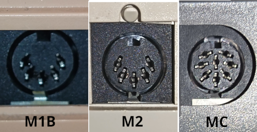
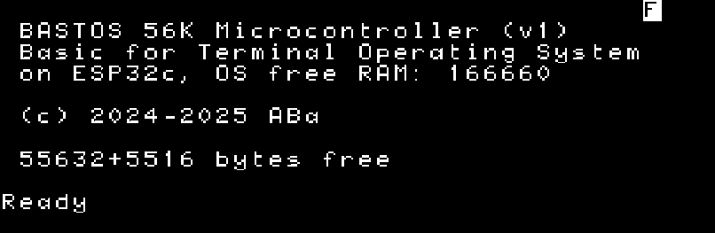
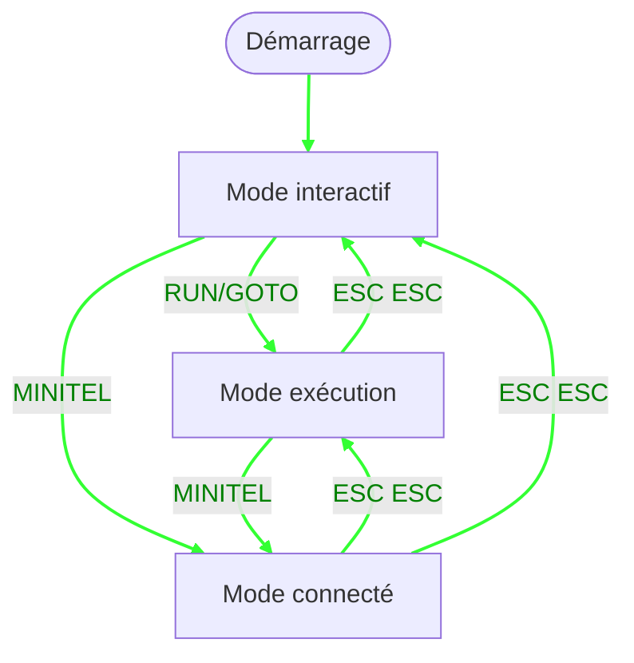

<!--  -->

<!-- center-on -->
{width=60%}
<!-- center-off -->

<!-- pagebreak -->

# 0. Mise en route

Brancher le module BASTOS sur la prise péri-informatique à l'arrière du Minitel.
Selon le modèle, la prise peut-être cachée par une glissière.



Brancher le Minitel, l'allumer (interrupteur sur M1B), sortir du mode veille la
cas échéant.

Quand le module est alimenté, la LED bleue commence à clignoter lentement, puis
passe en état fixe dès que la communication série est établie avec le Minitel.

L'écran du Minitel affiche alors le message d'initialisation de BASTOS :



# 1. Premiers pas

BASTOS est un dialecte BASIC conçu spécifiquement pour fonctionner sur terminal
Minitel via liaison série. Les programmes sont composés de lignes numérotées
exécutées dans l'ordre.

BASTOS dispose de trois modes opérationnels :

- **Mode interactif** : Les lignes entrées sont interprétées immédiatement. Si
  une ligne possède un numéro, elle est enregistrée dans le programme. C'est le
  mode d'entrée des commandes et d'édition des lignes de programme.

- **Mode exécution** : Un programme est en train de s'exécuter (lancé avec `RUN`
  ou `GOTO`). Le clavier peut être lu avec `INPUT`, `VKEY` et `INKEY$`. L'écran
  est contrôlé par `PRINT` et les commandes TTY. Appuyer deux fois sur ESC
  permet de sortir du mode exécution et de revenir au mode interactif.

- **Mode connecté** : BASTOS est connecté à un serveur via la commande
  `MINITEL`. Les entrées clavier sont envoyées au serveur, et l'écran affiche la
  réponse du serveur. Appuyer deux fois sur ESC permet de sortir du mode
  connecté et de revenir au mode précédent (soit exécution, soit interactif).



Au démarrage, si un fichier `autoexec.bas` existe sur le disque local, la
commande `RUN "autoexec.bas"` est **automatiquement** exécutée.

Exemple de programme `autoexec.bas` :

```
10 RUN "connect.bas"
```

# 2. Redémarrage

* La commande `BASTOS` permet de redéfinir les attributs par défaut pour BASTOS
  et afficher l'invite de commande initiale
* La commande `RESET` permet de réinitialiser BASTOS et de revenir en mode
  `SLOW` (prise à 1200 bps)
* Un appui court sur le bouton RESET est équivalent à la commande `RESET`
* Un appui long sur le bouton RESET fait `RESET` **et** n'exécute pas
  `autoexec.bas` au re-démarrage
* La suppression du fichier `autoexec.bas`, après un appui long sur RESET, peut
  aider à sortir d'une boucle infernale
* Finalement en ultime : Débrancher le module BASTOS et le rebrancher de/sur la
  DIN du Minitel

# 3. Se connecter à un réseau Wi-Fi

Pour voir les réseaux connus :

```
WIFI LIST
```

Si le réseau Wi-Fi est connu, on se connecte avec `WIFI "<nom du réseau>"`.
Sinon :

La première fois :

```
WIFI SCAN
WIFI <n° du réseau>
<Entrer le mot de passe en ligne 0 comme demandé>
OK
```

Voir _Troubleshooting_ si les caractères ne sont pas accessibles depuis le
clavier.

Les fois suivantes :

```
WIFI "<nom du réseau>"
OK
```

# 4. Se connecter au FTP BASTOS

Il faut être connecté au Wi-Fi.

Pour voir les FTP déjà configurés :

```
FTP LIST
```

Si le site "bastos" n'est pas configuré :

La première fois :

```
FTP "bastos", "ftp:abasty-retro.fr:2121:bastos"
OK
```

Les fois suivantes :

```
FTP "bastos"
OK
```

# 5. Télécharger et exécuter "meteor.bas"

Il faut être connecté au FTP BASTOS.

Pour voir le disque distant FTP : `FTP CAT`. Pour télécharger "meteor.bas" :

```
FTP GET "meteor.bas"
OK
```

Le fichier `meteor.bas` est téléchargé depuis le FTP BASTOS et sauvegardé sur le
disque local.

Il n'est pas nécessaire d'être connecté pour exécuter des programmes Basic sur
le disque local. Le cas échéant on peut vouloir se déconnecter du FTP et/ou du
Wi-Fi :

```
FTP STOP
WIFI STOP
```

Pour voir le disque local : `CAT`.


Pour charger et exécuter "meteor.bas" depuis le disque local :

```
RUN "meteor"
```

# 6. Se connecter à des services Minitel

Il faut être connecté au Wi-Fi.

La connexion aux services Minitel présents sur Internet se fait par TCP,
éventuellement avec une sur-couche WebSocket. Certains services purement RTC,
aujourd'hui sur VoIP, sont néanmoins accessibles à BASTOS par le service
Internet "Minipavi" qui agit en tant que passerelle (merci _ludojoey_, plus
d'info sur <https://www.minipavi.fr/>).

Pour voir les services Minitel déjà configurés :

```
MINITEL LIST
```

Pour se connecter à un service non configuré :

```
MINITEL "<nom du service>","<URN>"
```

Exemples :

* `MINITEL "minipavi", "tcp:go.minipavi.fr:516"`
* `MINITEL "3611", "ws:3611.re:80:/ws"`
* `MINITEL "3615", "ws:3615co.de:80:/ws"`
* `MINITEL "hacker", "ws:mntl.joher.com:2018:/?echo"`
* `M̀INITEL "rcampus", "tcp:bbs.retrocampus.com:1651"`

Pour se connecter à un service déjà configuré :

```
MINITEL "<nom du service>"
```

# Troubleshooting

## Caractères spéciaux dans références Wi-Fi

Si le SSID et/ou le mot de passe d'un réseau Wi-Fi contiennent des caractères
non accessibles depuis le clavier, il est possible d'entrer ses données en
utilisant des chaines de caractères contenant des codes hexadécimaux directement
dans la table des réseaux Wi-Fi connus.

Les codes hexadéciamux dans les chaines de caractères ont la forme `\xXY`.

La table des réseaux Wi-Fi connus porte le numéro 255 dans la base de données
auto-sauvegardée de BASTOS.

Ainsi la commande `PUT 255,"\x41\x62\x61", "to\x75\x6f"` définira le réseau de
SSID "Aba" et de mot de passe "toto".

`WIFI LIST` ou `DB LIST 255` affichent la table 255.

`WIFI "\x41\x62\x61"`, ou `WIFI "Aba"` dans cet exemple permettront de se
connecter au réseau.
