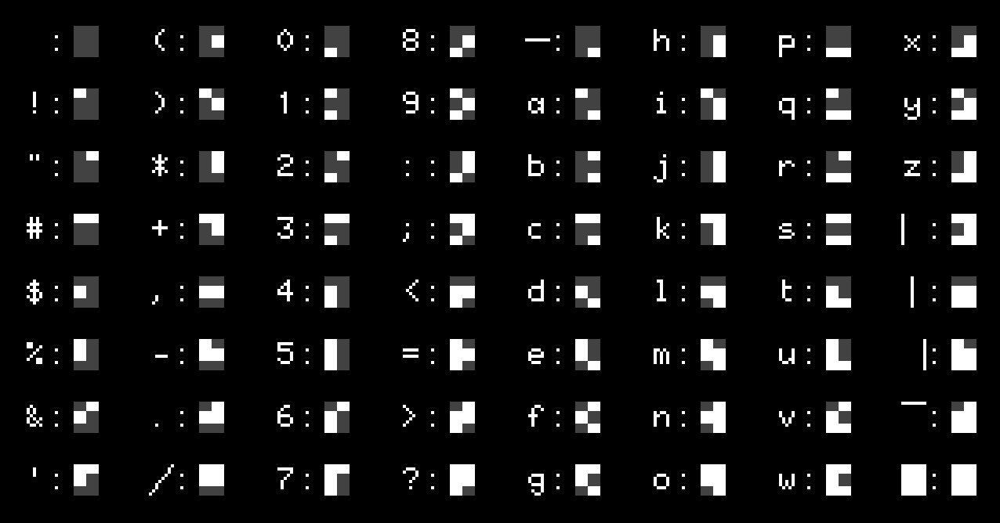
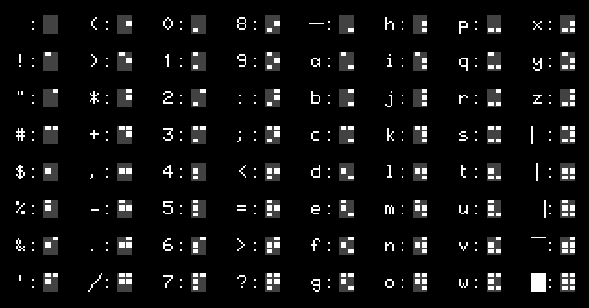

# Manuel du langage BASTOS

BASTOS est un dialecte BASIC conçu pour la carte ESP01. Les programmes sont
composés de lignes numérotées exécutées dans l'ordre ; la ligne 0, ou une ligne
sans numéro, est interprétée immédiatement (mode interactif).

```basic
10 PRINT "Bonjour !"
20 PAUSE 1000
30 GOTO 10
```

---

## Commandes du programme

| Commande | Description |
|----------|-------------|
| `RUN` | Exécuter depuis la première ligne |
| `RUN numligne` | Exécuter depuis une ligne précise |
| `RUN "fichier.bas"` | Charger et exécuter un programme ASCII |
| `RUN "fichier.bst", numligne` | Charger et exécuter un programme binaire et ses variables depuis une ligne |
| `LIST` | Lister 20 lignes depuis la position courante |
| `LIST numligne` | Lister 20 lignes depuis `numligne` |
| `LIST numligne, nombre` | Lister `nombre` lignes depuis `numligne` |
| `NEW` | Supprimer toutes les lignes du programme et les variables |
| `CLEAR` / `END` | Effacer les variables et stopper l'exécution |
| `STOP` | Suspendre l'exécution |
| `CONT` | Reprendre après `STOP` |
| `SAVE "fichier.bas"` | Sauvegarder le programme en ASCII |
| `SAVE "fichier.bst"` | Sauvegarder le programme et les variables en binaire |
| `SAVE "fichier.var"` | Sauvegarder les variables uniquement |
| `LOAD "fichier.bas"` | Charger un programme ASCII |
| `LOAD "fichier.bst"` | Charger le programme et les variables depuis un fichier binaire |
| `LOAD "fichier.var"` | Charger les variables uniquement |
| `ERASE "fichier"` | Supprimer un fichier |
| `CAT` | Lister les fichiers locaux |
| `FREE` | Afficher l'utilisation mémoire |
| `RESET` | Réinitialiser le système |
| `BASTOS` | Afficher la version et réinitialiser les attributs écran par défaut |

---

## PRINT / INPUT

### PRINT

Affiche des expressions à l'écran, suivies d'un saut de ligne. `?` est un
raccourci pour `PRINT`.

```basic
PRINT expr [, expr ...]      ' Espace entre les éléments
PRINT expr ; expr            ' Pas d'espace entre les éléments
PRINT                        ' Afficher une ligne vide
? expr                       ' Identique à PRINT expr
```

Un `;` en fin de ligne supprime le saut de ligne final :

```basic
PRINT "Entrez une valeur : ";
INPUT n
```

Les expressions numériques et les chaînes peuvent être mélangées librement :

```basic
PRINT "Résultat : "; a * 2
PRINT "Nom : " n$ ", âge : " a
```

Positionner l'affichage avec `AT ligne, col` :

```basic
AT 5, 10; "Bonjour"
```

Rediriger tout l'affichage vers une variable chaîne :

```basic
OUTPUT START m$
CLS
AT 10, 13; "*** METEOR ***"
OUTPUT STOP
PRINT m$
```

### INPUT

Lit une valeur au clavier et l'affecte à une variable.

```basic
INPUT variable
INPUT "invite", variable
```

- Pour une variable numérique, attend un nombre.
- Pour une variable chaîne (`$`), lit jusqu'à Entrée.
- Après la saisie, `VKEY` contient le code de la touche de validation.

Codes VKEY des touches de fonction du Minitel :

| Touche | VKEY | Notes |
|--------|------|-------|
| Entrée / ENVOI | 13 | Termine la saisie |
| CORRECTION | 127 | Efface le dernier caractère ; non retourné par INPUT |
| ANNULATION | 1 | Efface toute la saisie ; non retourné par INPUT |
| REPETITION | 2 | Termine la saisie |
| SUITE | 4 | Termine la saisie |
| RETOUR | 5 | Termine la saisie |
| SOMMAIRE | 6 | Termine la saisie |
| GUIDE | 14 | Termine la saisie |

Les touches non imprimables (comme les touches de fonction) ne peuvent pas être lues comme des caractères réguliers. Utiliser `CODE INKEY$` pour obtenir le code numérique :

```basic
10 k$ = INKEY$
20 PAUSE 100
30 k = CODE k$
40 IF k = 0 THEN GOTO 10
50 PRINT "Code touche : "; k
60 GOTO 10
```

Lecture non bloquante (sans attente) :

```basic
k$ = INKEY$
IF k$ <> "" THEN PRINT "Touche : " k$
```

---

## Types, variables, calculs

### Types

| Type | Suffixe | Stockage |
|------|---------|----------|
| Nombre | aucun | flottant 32 bits |
| Chaîne | `$` | longueur variable |

Les littéraux numériques peuvent être écrits en décimal ou en hexadécimal :

```basic
a = 255
a = 0xff
a = 0x1f
```

Les littéraux chaîne supportent les séquences d'échappement :

| Échappement | Description |
|-------------|-------------|
| `\n` | Saut de ligne |
| `\r` | Retour chariot |
| `\e` | Échap (0x1B) |
| `\xNN` | Octet hexadécimal |

```basic
a$ = "bonjour\n"
b$ = "\e[2J"          ' effacement écran ANSI
c$ = "\x1b\x41\x42"  ' Échap + 'A' + 'B'
```

### Caractères semi-graphiques

Appuyer sur **Ctrl+G** pour basculer entre les jeux G0 (ASCII) et G1
(semi-graphiques). Les caractères tapés en mode G1 sont affichés depuis le jeu
semi-graphique. Les images suivantes montrent la correspondance entre les
caractères G0 au clavier et leurs équivalents semi-graphiques G1 :




### Caractères UTF-8 supportés (conversion Minitel)

Lors du `LOAD` d'un fichier `.bas` ASCII, BASTOS convertit une liste limitée
de caractères UTF-8 en séquences Minitel (préfixe SS2, code `0x19`).

| Glyph | Séquence UTF-8 | Séquence Minitel produite |
|-------|----------------|---------------------------|
| à | `\xC3\xA0` | `\x19Aa` |
| è | `\xC3\xA8` | `\x19Ae` |
| ù | `\xC3\xB9` | `\x19Au` |
| é | `\xC3\xA9` | `\x19Be` |
| â | `\xC3\xA2` | `\x19Ca` |
| ê | `\xC3\xAA` | `\x19Ce` |
| î | `\xC3\xAE` | `\x19Ci` |
| ô | `\xC3\xB4` | `\x19Co` |
| û | `\xC3\xBB` | `\x19Cu` |
| ä | `\xC3\xA4` | `\x19Ha` |
| ë | `\xC3\xAB` | `\x19He` |
| ï | `\xC3\xAF` | `\x19Hi` |
| ö | `\xC3\xB6` | `\x19Ho` |
| ü | `\xC3\xBC` | `\x19Hu` |
| ç | `\xC3\xA7` | `\x19Kc` |
| Ç | `\xC3\x87` | `\x19KC` |
| ß | `\xC3\x9F` | `\x19\x7B` |
| £ | `\xC2\xA3` | `\x19\x23` |
| § | `\xC2\xA7` | `\x19\x27` |
| ° | `\xC2\xB0` | `\x19\x30` |
| ± | `\xC2\xB1` | `\x19\x31` |
| ÷ | `\xC3\xB7` | `\x19\x38` |
| ¼ | `\xC2\xBC` | `\x19\x34` |
| ½ | `\xC2\xBD` | `\x19\x35` |
| ¾ | `\xC2\xBE` | `\x19\x36` |
| Π| `\xC5\x92` | `\x19\x6A` |
| œ | `\xC5\x93` | `\x19\x7A` |

Les autres caractères UTF-8 ne sont pas convertis et restent inchangés.

### Noms de variables

- Numérique : un ou plusieurs caractères, ex. `x`, `compteur`, `total`
- Chaîne : nom terminé par `$`, ex. `nom$`, `buf$`
- Les mots-clés sont insensibles à la casse ; le contenu des chaînes est sensible à la casse.

```basic
compteur = 3.14
nom$ = "bonjour"
```

Affectation avec ou sans `LET` :

```basic
LET x = 42
x = 42
```

### Tableaux

Déclarer avec `DIM` avant utilisation. Les tableaux sont indexés à partir de **1**.

```basic
DIM a(10)             ' tableau 1-D de 10 nombres
DIM m(5, 5)           ' tableau 2-D
DIM s$(10, 25)        ' tableau de chaînes, 25 caractères max chacune
```

Accès :

```basic
a(3) = 99
PRINT a(3)
m(2, 4) = 1.5
s$(1) = "premier"
```

### Opérations sur les chaînes

Les parenthèses sont optionnelles pour toutes les fonctions ; ne les utiliser que pour grouper.

| Opération | Syntaxe | Exemple |
|-----------|---------|---------|
| Concaténation | `a$ + b$` | `"bonjour" + " monde"` |
| Longueur | `LEN s$` | `LEN "abc"` → `3` |
| Lecture sous-chaîne | `s$(début TO fin)` | `a$(11 TO 13)` |
| Écriture sous-chaîne | `s$(début TO fin) = "..."` | `a$(1 TO 3) = "XYZ"` |
| Code ASCII | `CODE s$` | `CODE "A"` → `65` |
| Caractère | `CHR$ n` | `CHR$ 65` → `"A"` |
| Vers nombre | `VAL s$` | `VAL "3.14"` → `3.14` |
| Vers chaîne | `STR$ n` | `STR$ 42` → `"42"` |
| Recherche | `INDEX s1$, s2$` | `INDEX "bonjour", "on"` → `2` |
| Recherche depuis pos | `INDEX s1$, s2$, début` | |
| Répétition | `REP n, s$` | `REP 3, "-"` → `"---"` |

```basic
PRINT LEN a$
PRINT CODE k$
z$ = CHR$ 0
ia$ = CHR$(CODE a$ & 223)   ' parenthèses pour grouper uniquement
```

Les indices de sous-chaîne utilisent le mot-clé `TO`. `début` vaut `1` par défaut, `fin` vaut `LEN s$` par défaut :

```basic
a$ = "Alice and Bob"
PRINT a$(11 TO 13)   ' "Bob"
PRINT a$(TO 5)       ' "Alice"  (début omis → 1)
PRINT a$(7 TO)       ' "d Bob"  (fin omise → LEN a$)
PRINT a$(TO)         ' chaîne entière
```

### Opérateurs arithmétiques

| Opérateur | Description |
|-----------|-------------|
| `*` `/` `%` | Multiplication, division, modulo |
| `+` `-` | Addition, soustraction |
| `&` | ET binaire |
| `\|` | OU binaire |

### Opérateurs de comparaison

| Opérateur | Signification |
|-----------|---------------|
| `=` | Égal |
| `<>` | Différent |
| `<` `>` | Inférieur / supérieur |
| `<=` `>=` | Inférieur ou égal / supérieur ou égal |

Le résultat est `1` (vrai) ou `0` (faux).

### Opérateurs logiques

```basic
IF a > 0 AND b > 0 THEN PRINT "les deux positifs"
IF a = 0 OR b = 0 THEN PRINT "l'un est nul"
IF NOT a THEN PRINT "a est nul"
```

### Fonctions mathématiques

Les parenthèses sont optionnelles ; ne les utiliser que pour grouper des sous-expressions.

| Fonction | Description |
|----------|-------------|
| `ABS x` | Valeur absolue |
| `INT x` | Troncature entière |
| `SGN x` | Signe : -1, 0 ou 1 |
| `SQR x` | Racine carrée |
| `SIN x` `COS x` `TAN x` | Trigonométrie |
| `ASN x` `ACS x` `ATN x` | Trigonométrie inverse |
| `EXP x` | e^x |
| `LN x` | Logarithme naturel |
| `RND` | Flottant aléatoire 0.0–1.0 |
| `PI` | 3.1415926536 |

```basic
PRINT ABS -5
PRINT SQR 2
PRINT INT(a / b)    ' parenthèses pour grouper
```

---

## Structures de contrôle

### IF / THEN

```basic
IF expression THEN numligne
IF expression THEN instruction
```

```basic
10 INPUT "x : ", x
20 IF x < 0 THEN PRINT "négatif"
30 IF x = 0 THEN 10
40 PRINT "positif"
```

⚠️ **Piège courant** : `IF a > 0 THEN a=a-1` ne fonctionnera pas comme prévu.
`a=a-1` est traité comme une comparaison (« a est-il égal à a-1 ? »), ce qui
évalue à `0` (faux). Utiliser `LET` pour en faire une affectation : `IF a > 0
THEN LET a = a - 1`.

### FOR / NEXT

```basic
FOR var = début TO fin
FOR var = début TO fin STEP pas
NEXT var
```

- `var` doit être une lettre unique `A`–`Z`.
- Un `STEP` négatif compte à rebours.
- Les boucles peuvent être imbriquées.

```basic
10 FOR i = 1 TO 5
20 PRINT i
30 NEXT i

40 FOR i = 10 TO 1 STEP -1
50 PRINT i
60 NEXT i
```

### GOTO

```basic
GOTO numligne
```

```basic
10 PRINT "boucle"
20 PAUSE 1000
30 GOTO 10
```

### GOSUB / RETURN

```basic
GOSUB numligne    ' Appeler un sous-programme
RETURN            ' Retourner à l'appelant
```

Jusqu'à 32 appels imbriqués.

```basic
10 GOSUB 1000
20 END

1000 PRINT "Dans le sous-programme"
1010 RETURN
```

### PAUSE

```basic
PAUSE millisecondes
```

```basic
PRINT "Attendre 2 secondes..."
PAUSE 2000
PRINT "Terminé"
```

---

## Base de données

BASTOS dispose d'un magasin clé/valeur organisé en sets numérotés.

```basic
GET set                      ' Renvoie toutes les clés du set sous forme de chaîne
GET set, "clé"               ' Renvoie la valeur associée à une clé
PUT set, "clé", "valeur"     ' Stocker ou mettre à jour une paire clé/valeur
DB LIST set                    ' Lister toutes les entrées du set
DB ERASE set, "clé"            ' Supprimer une entrée par clé du set
```

Les sets sont numérotés à partir de 0. Clés et valeurs sont des chaînes. Les connexions WiFi, Minitel et FTP utilisent des sets spécifiques pour persister leur configuration.

```basic
PUT 1, "ville", "Paris"
PRINT GET(1, "ville")    ' "Paris"
```

`GET set` renvoie toutes les clés séparées par `\n`. La dernière clé est également suivie d'un `\n`. Utiliser `INDEX` pour les parcourir :

```basic
10 keys$ = GET 1
20 pos = 1
30 nl = INDEX(keys$, "\n", pos)
40 IF nl = 0 THEN END
50 key$ = keys$(pos TO nl - 1)
60 PRINT key$ " = " GET(1, key$)
70 pos = nl + 1
80 GOTO 30
```

---

## Réseau

### WiFi

```basic
WIFI SCAN                    ' Scanner les points d'accès disponibles
WIFI "ssid"                  ' Se connecter par SSID (mot de passe demandé si nécessaire)
WIFI START "ssid"            ' Identique (START est l'action par défaut)
WIFI n                       ' Se connecter au réseau numéro n (après SCAN)
WIFI LIST                    ' Lister les réseaux sauvegardés
WIFI STATUS                  ' Afficher l'état de la connexion
WIFI ERASE "ssid"            ' Supprimer un réseau sauvegardé
WIFI STOP                    ' Se déconnecter
```

Après `WIFI SCAN`, les réseaux sont numérotés ; utiliser `WIFI n` pour se connecter par index.

### Format URN

Les connexions réseau sont identifiées par un URN dont les parties sont séparées par `:` :

```
protocole:hôte:port[:chemin[:login[:motdepasse]]]
```

Pour `ftp`, `login` vaut `anonymous` et `motdepasse` vaut `pat@frites.be` par défaut si omis.

| Protocole | Description |
|-----------|-------------|
| `tcp` | Socket TCP brut |
| `ws` | WebSocket |
| `ftp` | FTP |

Exemples :

```
tcp:go.minipavi.fr:516
ws:3611.re:80:/ws
ftp:abasty-retro.fr:2121:bastos
ftp:files.example.com:21:/pub:monuser:monmotdepasse
ws:mntl.joher.com:2018:/?echo
```

### Minitel

Connexion à un serveur Minitel (émulation terminal Vidéotex) et sauvegarde sous un nom.

```basic
MINITEL "nom", "urn"         ' Connecter et sauvegarder sous "nom"
MINITEL START "nom", "urn"   ' Identique (START est l'action par défaut)
MINITEL "nom"                ' Se reconnecter à une connexion sauvegardée
MINITEL LIST                 ' Lister les connexions Minitel sauvegardées
MINITEL ERASE "nom"          ' Supprimer une connexion sauvegardée
```

Exemples :

```basic
MINITEL "minipavi", "tcp:go.minipavi.fr:516"
MINITEL "3615", "ws:3615co.de:80:/ws"
MINITEL "3615"               ' reconnexion par nom sauvegardé
```

### FTP

```basic
FTP "nom", "urn"             ' Connecter et sauvegarder sous "nom"
FTP START "nom", "urn"       ' Identique (START est l'action par défaut)
FTP "nom"                    ' Se reconnecter à une connexion sauvegardée
FTP LIST                     ' Lister les connexions FTP sauvegardées
FTP STATUS                   ' Afficher l'état de la connexion FTP
FTP PUT "fichier"            ' Envoyer un fichier (même nom local et distant)
FTP GET "fichier"            ' Recevoir un fichier (même nom local et distant)
FTP CAT                      ' Lister les fichiers distants
FTP ERASE "nom"              ' Supprimer une connexion sauvegardée
FTP STOP                     ' Se déconnecter
```

Exemple de session :

```basic
10 FTP "bastos", "ftp:abasty-retro.fr:2121:bastos"
20 FTP STATUS
30 FTP GET "snake.bas"
40 FTP STOP
```

---

## Affichage et TTY

L'écran dispose de deux modes d'affichage : **Vidéotex (40 colonnes)** et
**Téléinformatique (80 colonnes)**. La ligne 0 est une ligne d'état ; la zone
d'affichage comporte 24 lignes en dessous. L'accès à la ligne 0 avec `LINE0`
(équivalent à `AT 0,1`) sauvegarde la position courante du curseur et les
attributs. Pour quitter la ligne 0 et retourner à la zone d'affichage, utiliser
`AT` ou `"\n"` (saut de ligne) ; `"\n"` restaure à la fois la position
sauvegardée et les attributs.

Les caractères proviennent de deux jeux : **G0 (ASCII)** pour le texte régulier,
et **G1 (semi-graphiques)** pour les graphiques à base de pixels. En G0, les
attributs sont soit locaux (INK, INVERSE, FLASH, SIZE) soit globaux (PAPER,
UNDERLINE) ; les attributs globaux doivent être précédés d'un séparateur espace.
En G1, tous les attributs sont locaux et ne nécessitent pas de séparateur ;
cependant, SIZE et INVERSE ne sont pas supportés, et UNDERLINE gère les
semi-graphiques disjoints.

Les fonctions TTY renvoient une chaîne contenant la séquence d'échappement
correspondante. Utilisées comme instruction, elles se comportent comme `PRINT
...; ` (émettent la séquence sans saut de ligne final). Utilisées comme
expression, elles peuvent être affectées ou intégrées dans une chaîne :

```basic
CLS                      ' instruction : envoie la séquence d'effacement écran
c$ = CLS                 ' expression : stocke la séquence dans c$
PRINT INK(3) "bonjour"   ' en ligne : changer la couleur puis afficher
m$ = AT(10,13) + "hi"   ' construire une chaîne avec positionnement
```

En mode Teletext (≤1), les fonctions TTY émettent des séquences Vidéotex. En
mode téléinformatique (≥2), elles émettent des séquences CSI (`ESC [ ...`).

### Écran

```basic
CLS                  ' Effacer l'écran
CLEOL                ' Effacer jusqu'à la fin de ligne
CURSOR n             ' 0=masquer, 1=afficher le curseur
BEEP                 ' Émettre un bip
MODE n               ' Mode écran : ≤1 = 40 cols Teletext, ≥2 = 80 cols téléinformatique
LINE0                ' Placer le curseur en ligne 0, colonne 1 (ligne d'état)
```

### Positionnement du curseur

```basic
AT ligne, col; expr
```

Lignes et colonnes sont indexées à partir de 1.

### Couleurs et attributs

```basic
INK couleur          ' Couleur de premier plan (0-7)
PAPER couleur        ' Couleur d'arrière-plan (0-7) ; sans effet en mode téléinformatique (≥2)
FLASH n              ' 0=normal, 1=clignotant
INVERSE n            ' 0=normal, 1=vidéo inverse
UNDERLINE n          ' 0=normal, 1=souligné
```

En mode téléinformatique, `INK 7` active la surbrillance ; `INK 0`–`6` la
désactive. `PAPER` est sans effet.

### Graphiques

Chaque caractère à l'écran est une matrice semi-graphique de 3 lignes × 2
colonnes de pixels. L'écran (hors ligne 0) comporte 24 lignes de 40 caractères,
soit **80 pixels de largeur × 72 pixels de hauteur**. L'origine **(0, 0) est en
bas à gauche** : x varie de 0–79 (gauche à droite), y varie de 0–71 (bas vers
haut).

```basic
PLOT x, y            ' Allumer un pixel
UNPLOT x, y          ' Éteindre un pixel
TEST(x, y)           ' Renvoie 1 si le pixel est allumé, 0 sinon
```

### Vitesse

```basic
SLOW                 ' Vitesse normale (défaut)
FAST                 ' Vitesse rapide
FAST2                ' Vitesse plus rapide
```
